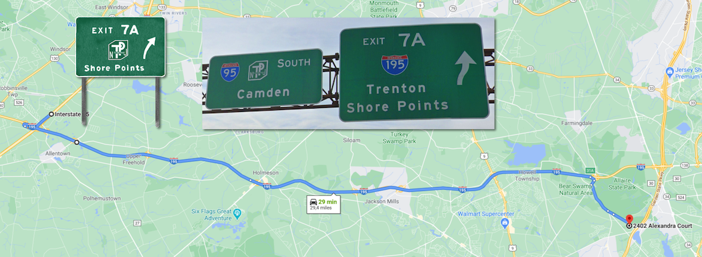
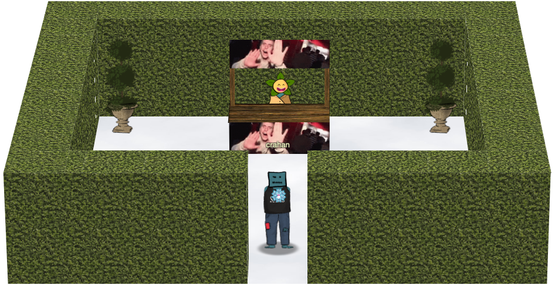
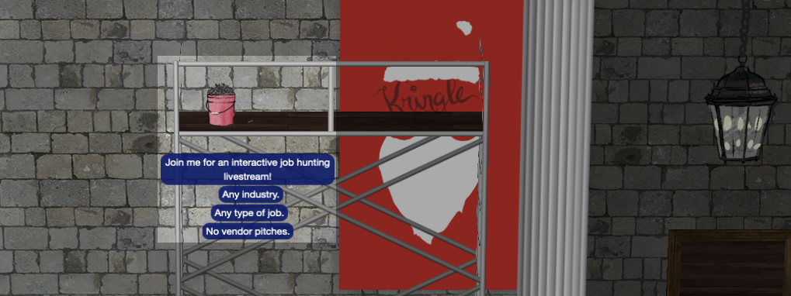
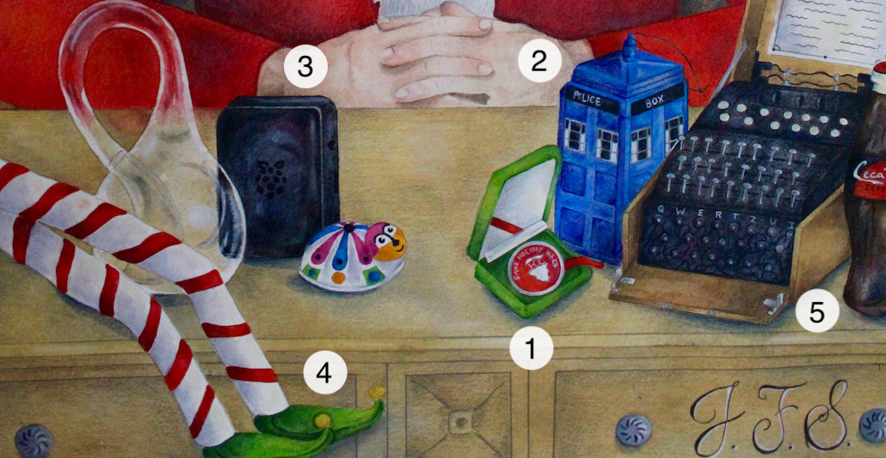
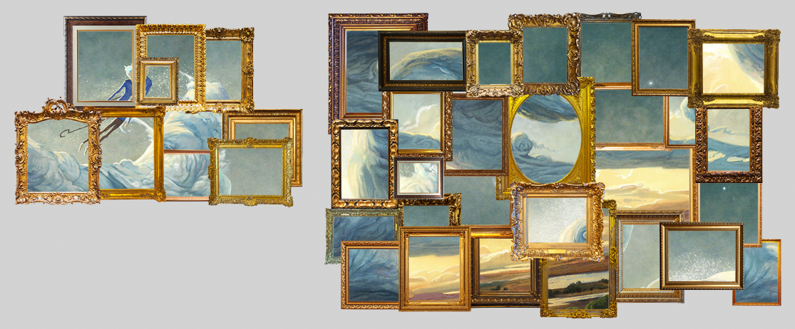
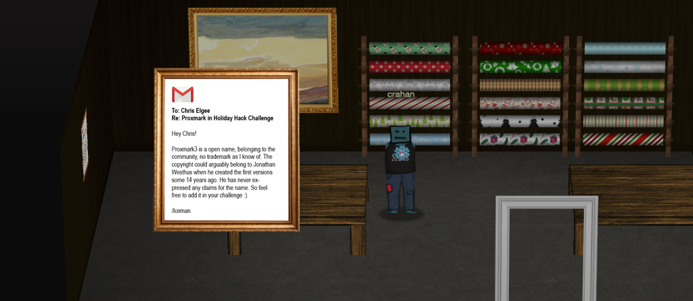
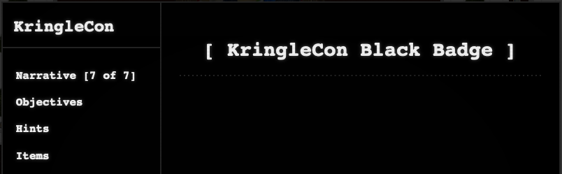
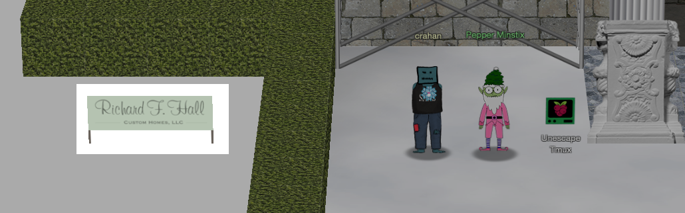

It's amazing how many references and easter eggs you can find once you start looking around for them. Movie references, jokes, nods to popular culture, memes, secret areas, references to past Holiday Hack Challenge, and funny WebSocket response messages. Below are a few of them, in no particular order.


## Three French Hens

When the title of this year's event was [announced on Twitter](https://twitter.com/KringleCon/status/1331629434865131523) a pattern emerged. Last year was named *KringleCon 2: Turtle Doves*, this time it's *KringleCon 3: French Hens*. The titles appear to be taken from the [Twelve Days of Christmas](https://www.metrolyrics.com/twelve-days-of-christmas-lyrics-christmas-carols.html) carol.

!!! abstract "The Twelve Days Of Christmas"
    ...<br/>
    On the second day of Christmas<br/>
    My true love gave to me:<br/>
    **Two turtle doves**<br/>
    ...<br/>
    On the third day of Christmas<br/>
    My true love gave to me:<br/>
    **Three french hens**<br/>
    ...<br/>
    On the forth day of Christmas<br/>
    My true love gave to me:<br/>
    **Four calling birds**<br/>
    ...


## Being John Malkovich

The idea of going to an in-between floor (i.e., 1.5) and ending up in the body of another person (i.e., Santa) is a direct reference to the movie [Being John Malkovich](https://en.wikipedia.org/wiki/Being_John_Malkovich). In the movie, directed by Spike Jonze and written by Charlie Kaufman, a puppeteer discovers a portal on a floor between the 7th and 8th that leads literally into the head of movie star John Malkovich, similar to how we go to a floor between the 1st and 2nd floors and ultimately end up being Santa. 


## New Jersey Turnpike



When the Holiday Hack Challenge website tells you to *hop on the New Jersey Turnpike to get to Santa's gondola for your ride to the North Pole*, you can take that pretty literally. Taking exit 7A and [following Interstate 195](https://www.google.com/maps/dir/40.2023607,-74.5887366/2402+Alexandra+Ct,+Wall+Township,+NJ+07731,+USA/@40.1574196,-74.410594,31064m/data=!3m1!1e3!4m14!4m13!1m5!3m4!1m2!1d-74.5683648!2d40.1850402!3s0x89c160eb5383cfe3:0xc6d937e42824bd8!1m5!1m1!1s0x89c1812c891f19a3:0x1a85bb1101118d8c!2m2!1d-74.1266799!2d40.133793!3e0) to Shore Points, brings you close to the Counter Hack HQ, better known as Santa's castle. :smile: 

The New Jersey Turnpike also plays a key role in the movie [Being John Malkovich](./easter_eggs.md#being-john-malkovich). It's where the movie's main character ends up when he's ejected from John Malkovich's mind and body after about 15 minutes. 


## Zat You, Santa Claus?

<iframe width="560" height="315" src="https://www.youtube.com/embed/f0oY7F8m4fo" frameborder="0" allow="accelerometer; autoplay; clipboard-write; encrypted-media; gyroscope; picture-in-picture" allowfullscreen></iframe>

A direct reference to the song *Zat You, Santa Claus?* by [Louis Armstrong](https://www.youtube.com/watch?v=f0oY7F8m4fo).


## Garden Party



To the North and slightly off to the East of the swag booth you can pass through the hedge to enter a secret area. The NPC behind the booth is named *npc-evanbooth*, Counter Hack's [resident builder, architect, developer, and challenge designer](https://www.counterhack.com/expert-pen-testers). The clip that's playing is the [original video](https://www.youtube.com/watch?v=3Nkb3g-yySs) for what later became the [Dimitri Finds Out meme](https://knowyourmeme.com/memes/dimitri-finds-out). You can't go there as Santa though. 


## Santa Discounts

When you talk to the SANS.edu and RSA Conference booth NPCs as Santa, they'll give you a discount code. Also, the NPCs manning the conference booths all have actual names. Can we get a round of applause for Brian, Peaches, Geek, Jeff, and Kulj, please? :clap:

!!! quote "Geek - SANS.edu booth"
    Hi Santa!
    
    Because you give so much to the world, we’re giving you a code to waive your application fee to SANS.edu, the best college in cybersecurity.

    Use the code `SantaGoesToCollege` when you apply.

    Thanks for hacking for good!

!!! quote "Kulj - RSA Conference booth"
    Congratulations, Santa! You’ve unlocked $20 off a Full Summit Pass for the new RSAC 365 Virtual Summit.

    Use code `10SANSF59`. [Click to learn more](https://www.rsaconference.com/virtual-series/fds1-summit).


## Jason



Just like last year's event, Jason can be found in 2 different locations. First as the nail next to the bucket image named `jason 2.png` on the scaffolding in front of the castle and again as an ASCII art image of a plant located at `/opt/plant.txt`. The ASCII image can also be found when entering `plant` as a menu option in the [Kringle Kiosk](./hints/h2.md) Terminal Hint challenge. 

```
  Hi, my name is Jason the Plant!

  ( U
   \| )
  __|/
  \    /
   \__/ ejm96
```

Jason himself actually [tweeted a hint](https://twitter.com/BanjoCrashland/status/1342507427632193538) for this Easter Egg on December 25, 2020.

!!! quote "Nail"
    Job Hunting? Feeling Stuck?<br/>
    Join me for an interactive job hunting livestream!<br/>
    Any industry.<br/>
    Any type of job.<br/>
    No vendor pitches.<br/>
    Not selling anything.<br/>
    Just helping.<br/>
    https://www.twitch.tv/banjocrashland


## Portrait Painting



The portrait features Ed Skoudis as Santa Claus and was painted by Ed's artist daughter Jessica Skoudis (who is also mentioned in the final credits). The initials on the portrait not only refer to *Jack Frost: Santa*, as per the narrative, but are in fact Jessica's initials. The items on the desk are references to [past Holiday Hack Challenge events](https://holidayhackchallenge.com/past-challenges/).

| #  | Item           | Holiday Hack Challenge                                                                                              |
| :- | :------------- | :-------------------------------------------------------------------------------------------------------------------|
| 1  | Challenge coin | First introduced as an award in HHC 2019                                                                            |
| 2  | Tardis         | Seen on the [dorm wall](https://n00.be/HolidayHackChallenge2019/misc/interesting_ui/#dorm-access-code) in HHC 2019  |
| 3  | Cranberry Pi   | First appeared in HHC 2018                                                                                          |
| 4  | Gnome legs     | Also [created by Jessica Skoudis](https://twitter.com/edskoudis/status/675068303430295553) and featured in HHC 2015 |
| 5  | Enigma machine | Seen in [an image](./img/misc/hhc2012.jpg) for HHC 2012                                                             |


## Painting Peephole Trope

Someone peering through the eyes of a painting is a [common TV trope](https://tvtropes.org/pmwiki/pmwiki.php/Main/PortraitPaintingPeephole) and is used in a [lot of movies and TV series](https://www.youtube.com/watch?v=JGz_ymaGJPI). The Scooby-Doo animated series used it extensively, for example.

!!! quote "Scooby-Doo - TV Tropes"
    It was common for Scooby-Doo to feature a scene of the characters moving past a portrait with moving eyes. A series of Cartoon Network promos for the show titled Scooby-Doo: Behind the Scenes had the characters lampshading the trope in the final promo "Those Meddling Kids, Together Again" and Velma jokingly asking why weren't there any haunted houses with landscape paintings.

Landscape paintings? Perfect segue into the next easter egg! :grinning:


## Castle Artwork



All the artwork spread across Santa's castle is cut from a single image. If you download all the textures from `https://2020.kringlecon.com/textures/art/f{1-39}.png`, you can recreate a [Jack Frost painting](https://riseoftheguardians.fandom.com/wiki/Jack_Frost_(The_Guardians_of_Childhood)?file=JackFrost-PicBookWJ.jpg) by [Andrew Theophilopoulos](https://theonidas.artstation.com/). Looks like Jack Frost replaced all the paintings with a piece of himself! Badum-TSS! :laughing:


## Proxmark Email



In the Wrapping Room there's an email message hanging on the left wall from [Iceman](https://github.com/iceman1001), addressed to Chris Elgee.

!!! abstract "Proxmark email"
    To: Chris Elgee<br/>
    Re: Proxmark in Holiday Hack Challenge

    Hey Chris!

    Proxmark3 is a open name, belonging to the
    community, no trademark as I know of. The
    copyright could arguably belong to Jonathan
    Westhus when he created the first versions
    some 14 years ago. He has never ex-
    pressed any claims for the name. So feel
    free to add it in your challenge :)

    /Iceman


## Black Badge



Santa has a black conference badge which is a nod to the [DEF CON Black Badge](https://www.defcon.org/html/links/dc-black-badge.html).

!!! abstract "DEF CON Black Badge"
    The DEF CON Black Badge is a powerful talisman, awarded only to those who have emerged unbeaten from the crucible of elite DEF CON competition. Which competitions? The answer varies from year to year. This is in the nature of the talisman.  Those chosen by the Badge enter DEF CON free of charge for the duration of their natural life.

## Wilhelm Scream

<iframe width="560" height="315" src="https://www.youtube.com/embed/cdbYsoEasio" frameborder="0" allow="accelerometer; autoplay; clipboard-write; encrypted-media; gyroscope; picture-in-picture" allowfullscreen></iframe>

In the [33.6kbps Terminal challenge](./hints/h5b.md), the `SCHHRRHHRTHRTR` [sound](https://dialup.kringlecastle.com/audio/trn.mp3) uses the famous [Wilhelm Scream](https://www.youtube.com/watch?v=cdbYsoEasio).


## Snowball Fight Error


The error screen when you lose a [Snowball Fight](./hints/h11a.md) game displays a QR code which leads to the [CounterHack website](https://www.counterhack.com) and the error code `501_PEBKAC_ERR_4EVA`, which translates to [Problem Exists Between Keyboard and Chair](https://www.urbandictionary.com/define.php?term=pebkac), Error, and Forever. In other words, user error. Pretty sure that if you contact the support elf and pass them the error code, they'd laugh at you. :smile:


## WebSocket Codes

The WebSocket at `wss://2020.kringlecon.com/ws` is a lot of fun to mess around with and others have gone above and beyond to write some [amazing helper scripts](https://github.com/pollev/santas_little_helper) that let you navigate the game without using the web UI. The `WS_OHHIMARK` and `DENNIS_NEDRY` WebSocket response codes are references to the movies The Room and Jurassic Park, respectively.

=== "WS_OHHIMARK"
    <iframe width="560" height="315" src="https://www.youtube.com/embed/aekfPU0SwNw" frameborder="0" allow="accelerometer; autoplay; clipboard-write; encrypted-media; gyroscope; picture-in-picture" allowfullscreen></iframe>

    The `WS_OHHIMARK` response code is a reference to the [famous scene](https://www.youtube.com/watch?v=aekfPU0SwNw) from the movie The Room.

=== "DENNIS_NEDRY"
    <iframe width="560" height="315" src="https://www.youtube.com/embed/RfiQYRn7fBg" frameborder="0" allow="accelerometer; autoplay; clipboard-write; encrypted-media; gyroscope; picture-in-picture" allowfullscreen></iframe>

    The `DENNIS_NEDRY` error code is a reference to [Jurassic Park](https://jurassicpark.fandom.com/wiki/Dennis_Nedry).


## Richard F. Hall



The billboard titled *Richard F. Hall - Custom Homes, LLC*, located next to the scaffolding in front of Santa's castle, is a reference to an [actual company](https://www.richardfhallcustomhomes.com) in the Jersey Shore area. Looking at their portfolio, it's pretty clear why Santa would choose them to help with the castle expansion. That's some impressive work! :astonished: 


## Stay Frosty Catchphrase

<iframe width="560" height="315" src="https://www.youtube.com/embed/ht2RJvc4ExI" frameborder="0" allow="accelerometer; autoplay; clipboard-write; encrypted-media; gyroscope; picture-in-picture" allowfullscreen></iframe>

Jack Frost isn't the only one who likes to use the *Stay frosty* catchphrase. It's actually used in a number of movies. The most famous one probably being [Aliens](https://www.youtube.com/watch?v=ht2RJvc4ExI) where [Corporal Hicks](https://avp.fandom.com/wiki/Dwayne_Hicks), played by Michael Biehn, uses it in a pep talk.

!!! quote "Corporal Hicks - Aliens"
    Hey! I know we’re all in strung-out shape but stay frosty and alert. We can’t afford to let one of those bastards in here.

Colonel Stars, played by Jim Carrey, also says it in [Kickass 2](https://www.imdb.com/title/tt1650554/).

!!! quote "Colonel Stars - Kickass 2"
    Stay frosty team. I used to eat punks like this for breakfast.


## Release the Snacken

The vending machine's name is a reference to *release the Kraken*. [The kraken](https://en.wikipedia.org/wiki/Kraken) is a legendary sea monster of gigantic size and cephalopod-like appearance in Scandinavian folklore. The phrase comes from the 1981 movie The Clash of the Titans (and its 2010 remake) and is known for being a [meme](https://knowyourmeme.com/memes/release-the-kraken) as well.


## The Lollipop Guild

The adversary group that Santa feared would attack KringleCon is a reference to [The Wizard of Oz](https://www.youtube.com/watch?v=XBsf8qsxs2M).

<iframe width="560" height="315" src="https://www.youtube.com/embed/XBsf8qsxs2M" frameborder="0" allow="accelerometer; autoplay; clipboard-write; encrypted-media; gyroscope; picture-in-picture" allowfullscreen></iframe>


## Naughty/Nice Reports

Dumping the reports from the [Naughty/Nice blockchain](./objectives/o11a.md) provides for some hilarious reading. Quite the welcome distraction once you've spent some time on [objective 11a](./objectives/o11a.md) and [objective 11b](./objectives/o11b.md). Below are just a few of examples from the 1547 reports.

!!! quote "Elf-on-the-shelf #10830630836554719419"
    Unbelievably, for the second time this year, I saw Shamicka leaving less than a swallow of orange juice in the container and putting it back into the refrigerator.

!!! quote "Elf-on-the-shelf #6203725506778794240"
    For the second time this month, we spotted Morad referring to someone as "bro".

!!! quote "Elf-on-the-shelf #809598375456514384"
    We've noticed that Chaquetta seems to be regularly discussing "The Bachelorette" as though it was actually something worthwhile.

Some reports noted some excellent behavior as well though. :ok_hand:

!!! quote "Elf-on-the-shelf #8151363711045738907"
    Happily, for the second time this year, I saw Hadassah not allowing their IOT devices to be accessible from the internet.

!!! quote "Elf-on-the-shelf #6864795698547819664"
    Maury was spotted running a marathon and not bragging about it to anyone twice today.

!!! quote "Elf-on-the-shelf #12595432874979467172"
    Three time now, Banjamin was seen being a vegan, but never making a big deal out of it.
