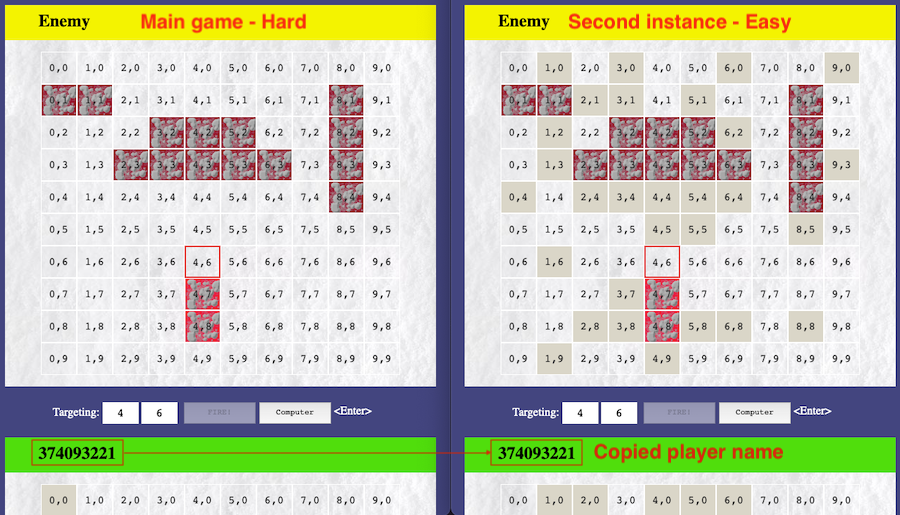
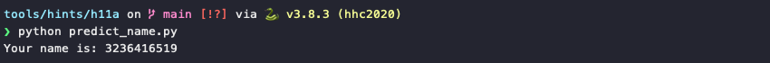
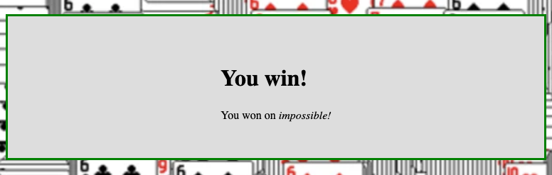

# Snowball Fight

**Elf**: Tangle Coalbox<br/>
**Direct link**: [snowball2 website](https://snowball2.kringlecastle.com/?challenge=snowball&id=e38447c5-a482-4139-a929-fd9fad04083e)<br/>
**Objective**: [Naughty/Nice List with Blockchain Investigation Part 1](../objectives/o11a.md) and [Part 2](../objectives/o11b.md)


## Request

!!! quote "Tangle Coalbox"
    Howdy gumshoe. I'm Tangle Coalbox, resident sleuth in the North Pole.<br/>
    If you're up for a challenge, I'd ask you to look at this here Snowball Game.<br/>
    We tested an earlier version this summer, but that one had web socket vulnerabilities.<br/>
    This version seems simple enough on the Easy level, but the Impossible level is, well...<br/>
    I'd call it impossible, but I just saw someone beat it! I'm sure something's off here.<br/>
    Could it be that the name a player provides has some connection to how the forts are laid out?<br/>
    Knowing that, I can see how an elf might feed their Hard name into an Easy game to cheat a bit.<br/>
    But on Impossible, the best you get are rejected player names in the page comments. Can you use those somehow?<br/>
    Check out Tom Liston's [talk](https://www.youtube.com/watch?v=Jo5Nlbqd-Vg) for more info, if you need it.


## Hints

??? hint "Mersenne Twister"
    Python uses the venerable Mersenne Twister algorithm to generate PRNG values after seed. Given enough data, an attacker might [predict](https://github.com/kmyk/mersenne-twister-predictor/blob/master/readme.md) upcoming values.

??? hint "PRNG Seeding"
    While system time is probably most common, developers have the option to [seed](https://docs.python.org/3/library/random.html) pseudo-random number generators with other values.

??? hint "Extra Instances"
    Need extra Snowball Game instances? Pop them up in a new tab from [https://snowball2.kringlecastle.com](https://snowball2.kringlecastle.com).

??? hint "Twisted Talk"
    Tom Liston is giving two talks at once - amazing! One is about the [Mersenne Twister](https://www.youtube.com/watch?v=Jo5Nlbqd-Vg).


## Solution

### Easy, medium, and hard

The board layout for both players is defined by the player name. The same player generates the same layout, allowing us to replay *easy* and *medium* difficulty games over and over until we win. To win a game on *hard* difficulty, copy the randomly generated player name into an additional *easy* game instance. Then use this second instance to locate all forts and help you win the *hard* game.



### Impossible

*Impossible* difficulty also generates a random player name but doesn't display the name anymore. To win the game we first need to predict the player name by cloning the state of the game's pseudo random number generator (PRNG) and using the cloned PRNG to generate the same random player name as the *impossible* game did.

The [`predict_name.py`](../tools/hints/h11a/predict_name.py) script helps with all the heavy lifting. It uses the [sample code](https://github.com/tliston/mt19937) mentioned in Tom Liston's [KringleCon talk](https://www.youtube.com/watch?v=Jo5Nlbqd-Vg) to create a 32-bit MT19937 (line 8), clone the game's internal PRNG state to it by feeding the 624 numbers through the `untemper()` function (lines 11-12), and generate the next random value (line 15). 

```python linenums="1" hl_lines="8 11-12 14"
if __name__ == "__main__":
    # Read discarded numbers from random.txt
    file = open('random.txt', 'r') 
    numbers = file.readlines() 
    numbers = [(int)(x.strip()) for x in numbers]

    # create an MT19937 PRNG
    myprng = mt19937(0)

    # clone the Snowball Fight PRNG
    for i in range(len(numbers)):
        myprng.MT[i] = untemper(numbers[i])

    # predict the player name
    print(f'Your name is: {myprng.extract_number()}')
```

Start an *impossible* game, copy the 624 rejected values from the game's HTML to `random.txt`, and run `predict_name.py`.  

{: class=border }

Similar to winning a *hard* game, use this predicted player name to generate an identical board layout on *easy* mode. Use the second instance to help determine the locations of all the forts. Be careful not to make any mistakes when copying the locations to the *impossible* game though as the computer doesn't make any mistakes at this difficulty setting!

{: class=border }


## Response

!!! quote "Tangle Coalbox"
    Crikey - that's it! You've done the Impossible! You've impressed this old elf today.<br/>
    Great work identifying and abusing the pseudo-random sequence.<br/>
    Now, the REAL question is, how else can this be abused? Do you think someone could try and cheat the Naughty/Nice Blockchain with this?<br/>
    If you have control over to bytes in a file, it's easy to create MD5 [hash collisions](https://github.com/corkami/collisions).<br/>
    Problem is: there's that nonce that he would have to know ahead of time.<br/>
    A blockchain works by "chaining" blocks together - so there's no way that Jack could change it without it messing up the chain...<br/>
    Maybe if you look at the block that seems like it got changed, it might help.<br/>
    If Jack was able to change the block AND the document without changing the hash... that would require a very [UNIque hash COLLision](https://github.com/cr-marcstevens/hashclash).<br/>
    Apparently Jack was able to change just 4 bytes in the block to completely change everything about it. It's like some sort of [evil game](https://speakerdeck.com/ange/colltris) to him.
