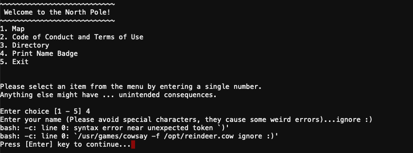
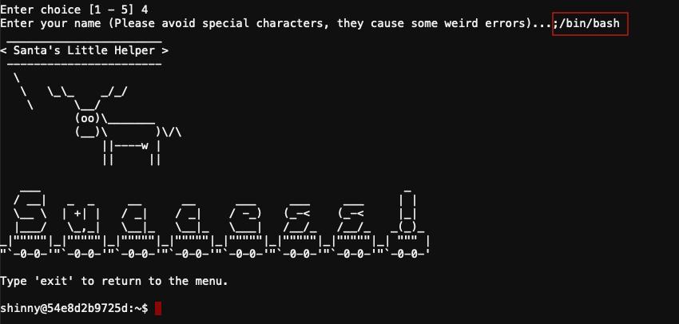
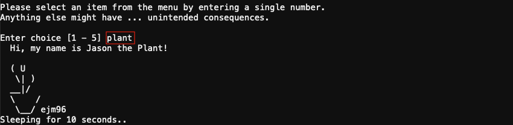

# Kringle Kiosk

**Elf**: Shinny Upatree<br/>
**Direct link**: [shell terminal](https://docker2020.kringlecon.com/?challenge=shell&id=4f2daf97-8808-4e06-a007-54e0c2463bed)<br/>
**Objective**: [Investigate S3 Bucket](../objectives/o2.md)


## Request

!!! quote "Shinny Upatree"
    Hiya hiya - I'm Shinny Upatree!<br/>
    Check out this cool KringleCon kiosk!<br/>
    You can get a map of the castle, learn about where the elves are, and get your own badge printed right on-screen!<br/>
    Be careful with that last one though. I heard someone say it's "ingestible." Or something...<br/>
    Do you think you could check and see if there is an issue?


## Hints

??? hint "Command Injection"
    There's probably some kind of [command injection](https://owasp.org/www-community/attacks/Command_Injection) vulnerability in the menu terminal.


## Solution

??? abstract "Welcome message"
    ```text
    Welcome to our castle, we're so glad to have you with us!
    Come and browse the kiosk; though our app's a bit suspicious.
    Poke around, try running bash, please try to come discover,
    Need our devs who made our app pull/patch to help recover?

    Escape the menu by launching /bin/bash

    Press enter to continue...
    ```

The objective is to escape the menu and run `/bin/bash`. Shinny hints at the badge printer being problematic so open that menu option. Completely ignore the warning about special characters and enter a few anyway. :smile:



It looks like our text is used unmodified as the input for `/usr/games/cowsay`. Leverage this [command injection](https://owasp.org/www-community/attacks/Command_Injection) vulnerability by adding a `;` to the end of the `cowsay` command and then run the `/bin/bash` as requested in the welcome message.



!!! done "Answer"
    Enter `;/bin/bash` as your badge name.

!!! note "Finding Jason!"
    The `/home/shinny/welcome.sh` script contains a hidden `plant` menu option (line 11) which will display the contents of `/opt/plant.txt`. There's an additional ASCII image of a mailbox at `/opt/mailbox.txt` but that file isn't used in the menu script.

    ```bash linenums="1" hl_lines="11"
    # read input from the keyboard and take a action
    read_options() {
      local choice
      read -r -p "Enter choice [1 - 5] " choice
      case $choice in
      1*) one ;;
      2*) two ;;
      3*) three ;;
      4*) four $choice ;;
      1) exit 0 ;;
      plant) surprise c;;
      *) echo -e "${RED}Error...${STD}" && sleep 2 ;;
      esac
    }
    ```

    Oh hi, [Jason](../easter_eggs.md#jason)! :stuck_out_tongue:

    


## Response

!!! quote "Shinny Upatree"
    Golly - wow! You sure found the flaw for us!<br/>
    Say, we've been having an issue with an Amazon S3 bucket.<br/>
    Do you think you could help find Santa's package file?<br/>
    Jeepers, it seems there's always a leaky bucket in the news. You'd think we could find our own files!<br/>
    Digininja has a great guide, if you're new to S3 searching.<br/>
    He even released a tool for the task - what a guy!<br/>
    The package wrapper Santa used is reversible, but it may take you some trying.<br/>
    Good luck, and thanks for pitching in!
