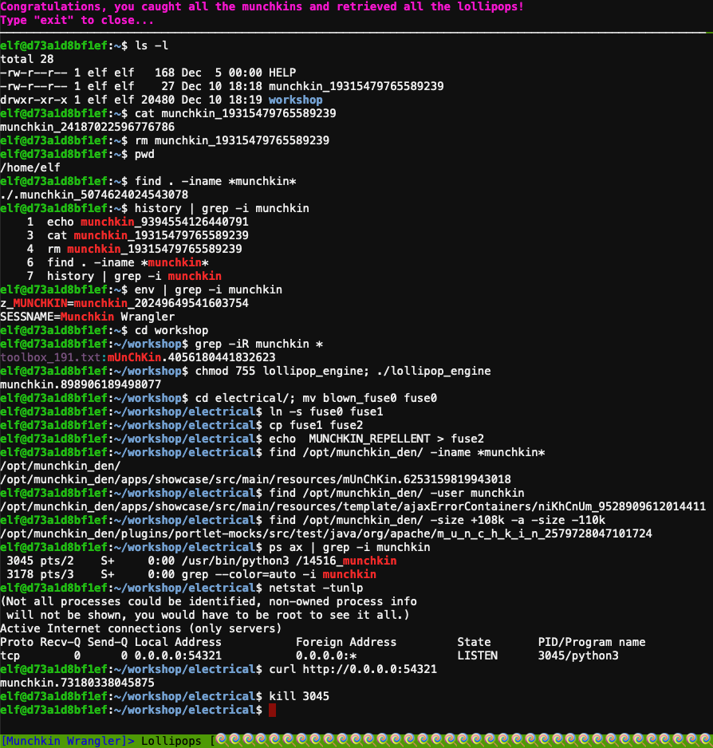

# Linux Primer

**Elf**: Sugarplum Mary<br/>
**Direct link**: [linux terminal](https://docker2020.kringlecon.com/?challenge=linux&id=e69a5b41-605a-4051-900f-e94472c9b85a)<br/>
**Objective**: [Point-of-Sale Password Recovery](../objectives/o3.md)


## Request

!!! quote "Sugarplum Mary"
    Sugarplum Mary? That's me!<br/>
    I was just playing with this here terminal and learning some Linux!<br/>
    It's a great intro to the Bash terminal.<br/>
    If you get stuck at any point, type `hintme` to get a nudge!<br/>
    Can you make it to the end?


## Solution

??? abstract "Welcome message"
    ```text
    The North Pole 🍭 Lollipop Maker:
    All the lollipops on this system have been stolen by munchkins.
    Capture munchkins by following instructions here and 🍭's will appear in the green bar below.
    Run the command "hintme" to receive a hint.
    ```

Many of the terminals at KringleCon are designed to help you get acquainted with a specific technology or tool. In this case the [Bash](https://www.gnu.org/software/bash/) command shell and some common shell commands. The *Answers* section below provides a copy/pastable overview of each of the commands. All entries link to [explainshell.com](https://explainshell.com/) which provides a detailed explanation of the command and its parameters.

!!! done "Answers"
    1. Perform a directory listing: [`ls -l`](https://explainshell.com/explain?cmd=ls+-l)
    2. Find the munchkin inside the munchkin: [`cat munchkin_19315479765589239`](https://explainshell.com/explain?cmd=cat+munchkin_19315479765589239)
    3. Remove the munchkin in your home dir: [`rm munchkin_19315479765589239`](https://explainshell.com/explain?cmd=rm+munchkin_19315479765589239)
    4. Print the present working dir: [`pwd`](https://explainshell.com/explain?cmd=pwd)
    5. Find the hidden munchkin: [`find . -iname *munchkin*`](https://explainshell.com/explain?cmd=find+.+-iname+*munchkin*)
    6. Find the munchkin in your command history: [`history | grep -i munchkin`](https://explainshell.com/explain?cmd=history+%7C+grep+-i+munchkin)
    7. Find the munchkin in your env vars: [`env | grep -i munchkin`](https://explainshell.com/explain?cmd=env+%7C+grep+-i+munchkin)
    8. Head into the workshop: [`cd workshop`](https://explainshell.com/explain?cmd=cd+workshop)
    9. Find which toolbox the munchkin is in: [`grep -iR munchkin *`](https://explainshell.com/explain?cmd=grep+-iR+munchkin+*)
    10. Run the `lollipop_engine` binary: [`chmod 755 lollipop_engine; ./lollipop_engine`](https://explainshell.com/explain?cmd=chmod+755+lollipop_engine%3B+.%2Flollipop_engine)
    11. `cd` into electrical and rename `blown_fuse0` to `fuse0`: [`cd electrical/; mv blown_fuse0 fuse0`](https://explainshell.com/explain?cmd=cd+electrical%2F%3B+mv+blown_fuse0+fuse0)
    12. Make a symbolic link named `fuse1` that points to `fuse0`: [`ln -s fuse0 fuse1`](https://explainshell.com/explain?cmd=ln+-s+fuse0+fuse1)
    13. Make a copy of `fuse1` named `fuse2`: [`cp fuse1 fuse2`](https://explainshell.com/explain?cmd=cp+fuse1+fuse2)
    14. Add *MUNCHKIN_REPELLENT* into the file `fuse2`[`echo  MUNCHKIN_REPELLENT > fuse2`](https://explainshell.com/explain?cmd=echo++MUNCHKIN_REPELLENT+%3E+fuse2)
    15. Find the munchkin somewhere in `/opt/munchkin_den`: [`find /opt/munchkin_den/ -iname *munchkin*`](https://explainshell.com/explain?cmd=find+%2Fopt%2Fmunchkin_den%2F+-iname+*munchkin*)
    16. Find the file in `/opt/munchkin_den` that is owned by the user `munchkin`: [`find /opt/munchkin_den/ -user munchkin`](https://explainshell.com/explain?cmd=find+%2Fopt%2Fmunchkin_den%2F+-user+munchkin)
    17. Find the file created by munchkins >108 Kb and <110 Kb in `/opt/munchkin_den`: [`find /opt/munchkin_den/ -size +108k -a -size -110k`](https://explainshell.com/explain?cmd=find+%2Fopt%2Fmunchkin_den%2F+-size+%2B108k+-a+-size+-110k)
    18. List running processes to find another munchkin: [`ps ax | grep -i munchkin`](https://explainshell.com/explain?cmd=ps+ax+%7C+grep+-i+munchkin)
    19. Use a command to have the only listening port display: [`netstat -tunlp`](https://explainshell.com/explain?cmd=netstat+-tunlp)
    20. Interact with this server to retrieve the last munchkin: [`curl http://0.0.0.0:54321`](https://explainshell.com/explain?cmd=curl+http%3A%2F%2F0.0.0.0%3A54321)
    21. Stop the `14516_munchkin` process: [`kill 3045`](https://explainshell.com/explain?cmd=kill+3045)




## Response

!!! quote "Sugarplum Mary"
    You did it - great! Maybe you can help me configure my postfix mail server on Gentoo!<br/>
    Just kidding!<br/>
    Hey, wouldja' mind helping me get into my point-of-sale terminal?<br/>
    It's down, and we kinda' need it running.<br/>
    Problem is: it is asking for a password. I never set one!<br/>
    Can you help me figure out what it is so I can get set up?<br/>
    Shinny says this might be an Electron application.<br/>
    I hear there's a way to extract an ASAR file from the binary, but I haven't looked into it yet.<br/>
