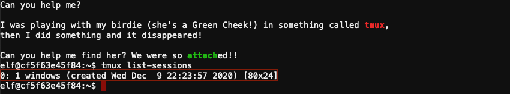
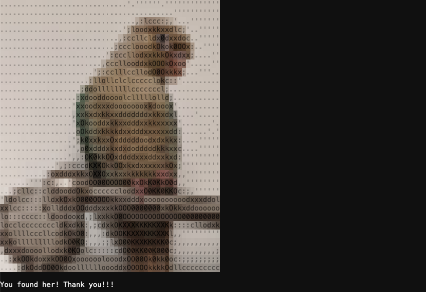

# Unscape Tmux

**Elf**: Pepper Minstix<br/>
**Direct link**: [tmux terminal](https://docker2020.kringlecon.com/?challenge=tmux&id=36714a0f-9f7b-482e-9fa7-0eaa5f63db18)<br/>
**Objective**: [Operate the Santavator](../objectives/o4.md)


## Request

!!! quote "Pepper Minstix"
    Howdy - Pepper Minstix here!<br/>
    I've been playing with tmux lately, and golly it's useful.<br/>
    Problem is: I somehow became detached from my session.<br/>
    Do you think you could get me back to where I was, admiring a beautiful bird?<br/>
    If you find it handy, there's a tmux cheat sheet you can use as a reference.<br/>
    I hope you can help!


## Hints

??? hint "Tmux Cheat Sheet"
    There's a handy tmux reference available at [https://tmuxcheatsheet.com/](https://tmuxcheatsheet.com/)!


## Solution

??? abstract "Welcome message"
    ```text
    Can you help me?

    I was playing with my birdie (she's a Green Cheek!) in something called tmux,
    then I did something and it disappeared!

    Can you help me find her? We were so attached!!

    Listing the available Tmux sessions using `tmux list-sessions` reveals a single session.
    ```



Attach the session using either `tmux a` or `tmux attach -t 0`.



!!! done "Answer"
    `tmux a`


## Response

!!! quote "Pepper Minstix"
    You found her! Thanks so much for getting her back!<br/>
    Hey, maybe I can help YOU out!<br/>
    There's a Santavator that moves visitors from floor to floor, but it's a bit wonky.<br/>
    You'll need a key and other odd objects. Try talking to Sparkle Redberry about the key.<br/>
    For the odd objects, maybe just wander around the castle and see what you find on the floor.<br/>
    Once you have a few, try using them to split, redirect, and color the Super Santavator Sparkle Stream (S4).<br/>
    You need to power the red, yellow, and green receivers with the right color light!
