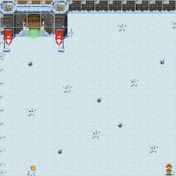
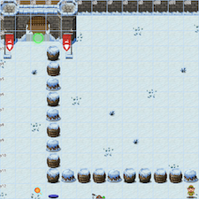
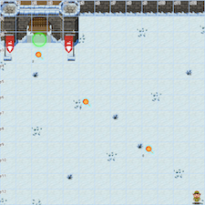
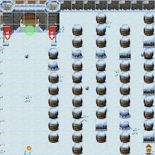
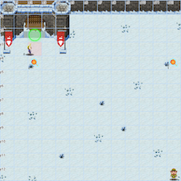
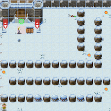
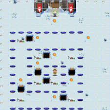
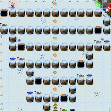

# The Elf C0de

**Elf**: Ribb Bonbowford<br/>
**Direct link**: [elfcode website](https://elfcode.kringlecastle.com/?challenge=elfcode&id=51d07db3-42ed-476e-a175-2d331eb19031)<br/>
**Objective**: [Operate the Santavator](../objectives/o4.md)


## Request

!!! quote "Ribb Bonbowford"
    Hello - my name is Ribb Bonbowford. Nice to meet you!<br/>
    Are you new to programming? It's a handy skill for anyone in cyber security.<br/>
    This challenge centers around JavaScript. Take a look at this intro and see how far it gets you!<br/>
    Ready to move beyond `elf` commands? Don't be afraid to mix in native JavaScript.<br/>
    Trying to extract only numbers from an array? Have you tried to `filter`?<br/>
    Maybe you need to enumerate an object's keys and then filter?<br/>
    Getting hung up on number of lines? Maybe try to minify your code.<br/>
    Is there a way to `push` array items to the beginning of an array? Hmm...


## Hints

??? hint "Adding to Arrays"
    `var array = [2, 3, 4]; array.push(1)` doesn't do QUITE what was intended...

??? hint "Getting a Key Name"
    [In JavaScript you can enumerate an object's keys using `keys`, and filter the array using `filter`.](https://stackoverflow.com/questions/9907419/how-to-get-a-key-in-a-javascript-object-by-its-value)

??? hint "Filtering Items"
    [There's got to be a way to `filter` for specific `typeof` items in an array](https://developer.mozilla.org/en-US/docs/Web/JavaScript/Reference/Global_Objects/TypedArray/filter). Maybe [the `typeof` operator](https://developer.mozilla.org/en-US/docs/Web/JavaScript/Reference/Operators/typeof) could also be useful?

??? hint "Compressing JS"
    There are lots of ways to [make your code shorter](https://jscompress.com/), but the number of elf commands is key.

??? hint "JavaScript Primer"
    Want to learn a useful language? [JavaScript](https://jgthms.com/javascript-in-14-minutes/) is a great place to start! You can also test out your code using a [JavaScript playground](https://playcode.io/).

??? hint "JavaScript Loops"
    Did you try the JavaScript primer? There's a great section on looping.


## Solution

### Main levels

!!! done "Level 1"
    {: align=left }
    ```javascript linenums="1"
    elf.moveLeft(10)
    elf.moveUp(10)
    ```


!!! done "Level 2"
    {: align=left }
    ```javascript linenums="1"
    elf.moveLeft(6)
    var sum = elf.get_lever(0) + 2
    elf.pull_lever(sum)
    elf.moveLeft(4)
    elf.moveUp(10)
    ```

!!! done "Level 3"
    {: align=left }
    ```javascript linenums="1"
    for (var i = 0; i < lollipop.length; i++)
      elf.moveTo(lollipop[i]);

    elf.moveUp(1)
    ```

!!! done "Level 4"
    {: align=left }
    ```javascript linenums="1"
    for (var i = 0; i < 3; i++) {
      elf.moveLeft(3)
      elf.moveUp(12)
      elf.moveLeft(3)
      elf.moveDown(12)
    }
    ```

!!! done "Level 5"
    {: align=left }
    ```javascript linenums="1"
    elf.moveTo(lollipop[0])
    elf.moveTo(munchkin[0])
    var data = elf.ask_munch(0)
    var newdata = []
    
    for (var i = 0; i < data.length; i++)
      if (typeof data[i] === 'number') newdata.push(data[i])

    elf.tell_munch(newdata)
    elf.moveUp(2)
    ```

!!! done "Level 6"
    {: align=left }
    ```javascript linenums="1"
    for (var i = 0; i < 4; i++)
      elf.moveTo(lollipop[i])

    elf.moveTo(munchkin[0])
    var data = elf.ask_munch(0)
    var thekey = ''

    Object.keys(data).forEach(function(key) {
      if (data[key] === "lollipop")
        thekey = key
    })

    elf.tell_munch(thekey)
    elf.moveUp(2)
    ```

### Bonus levels

!!! done "Level 7"
    {: align=left }
    ```javascript linenums="1"
    function MyFilter(matrix) {
      var sum = 0
      for(var i = 0; i < matrix.length; i++)
        for(var j = 0; j < matrix[i].length; j++)
          if (typeof matrix[i][j] === 'number') sum += matrix[i][j]
      return sum
    }

    var funcs = [elf.moveDown, elf.moveLeft, elf.moveUp, elf.moveRight]

    for (var i = 1; i <= 8; i++) {
      funcs[(i-1)%4](i)
      elf.pull_lever(i-1)
    }

    elf.moveUp(2)
    elf.moveLeft(4)
    elf.tell_munch(MyFilter) 
    elf.moveUp(2)
    ```

!!! done "Level 8"
    {: align=left }
    ```javascript linenums="1"
    function MyFilter(matrix) {
      var sum = 0
      var thekey = ''
      for(var i = 0; i < matrix.length; i++)
        Object.keys(matrix[i]).forEach(function(key) {
          if (matrix[i][key] === "lollipop") thekey = key
        })
      return thekey
    }

    var lever_sum = 0
    var hor_steps = 1
    var funcs = [elf.moveRight, elf.moveLeft]

    for (var i = 0; i < 6; i++) {
      funcs[(i)%2](hor_steps)
      hor_steps += 2
      lever_sum += elf.get_lever(i)
      elf.pull_lever(lever_sum)
      elf.moveUp(2)
    }

    elf.tell_munch(MyFilter)
    elf.moveRight(12)
    ```


## Response

!!! quote "Ribb Bonbowford"
    Wow - are you a JavaScript developer? Great work!<br/>
    Hey, you know, you might use your JavaScript and HTTP manipulation skills to take a crack at bypassing the Santavator's S4.

