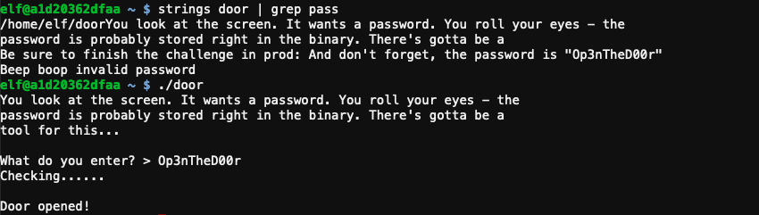
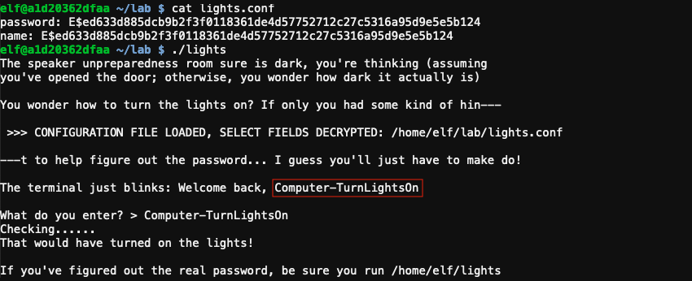
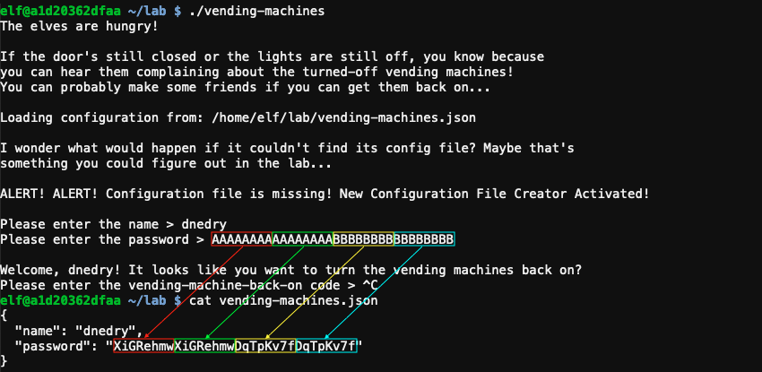
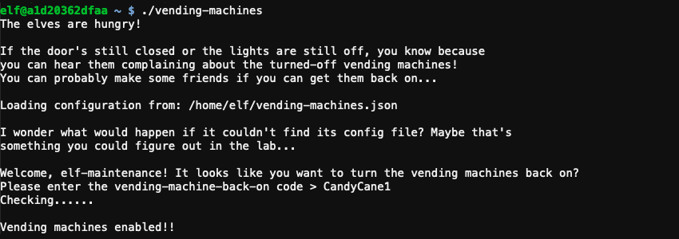

# Speaker UNPrep

**Elf**: Bushy Evergreen<br/>
**Direct link**: [speaker terminal](https://docker2020.kringlecon.com/?challenge=speaker&id=245995c5-d1c7-4983-b8e2-5a59bc27e062)<br/>
**Objective**: [Open HID Lock](../objectives/o5.md)


## Request

!!! quote "Bushy Evergreen"
    Ohai! Bushy Evergreen, just trying to get this door open.<br/>
    It's running some Rust code written by Alabaster Snowball.<br/>
    I'm pretty sure the password I need for ./door is right in the executable itself.<br/>
    Isn't there a way to view the human-readable strings in a binary file?


## Hints

??? hint "Strings in Binary Files"
    The `strings` command is common in Linux and available in Windows as part of SysInternals.

??? hint "Lookup Table"
    For polyalphabetic ciphers, if you have control over inputs and visibilty of outputs, lookup tables can save the day.    

??? hint "Letting a Program Decrypt for You"
    *While you have to use the `lights` program in `/home/elf/` to turn the lights on, you can delete parts in `/home/elf/lab/.*`.


## Solution

??? Abstract "Welcome message"
    ```text
    Help us get into the Speaker Unpreparedness Room!

    The door is controlled by ./door, but it needs a password! If you can figure
    out the password, it'll open the door right up!

    Oh, and if you have extra time, maybe you can turn on the lights with ./lights
    activate the vending machines with ./vending-machines? Those are a little
    trickier, they have configuration files, but it'd help us a lot!
    
    (You can do one now and come back to do the others later if you want)

    We copied edit-able versions of everything into the ./lab/ folder, in case you
    want to try EDITING or REMOVING the configuration files to see how the binaries
    react.
    
    Note: These don't require low-level reverse engineering, so you can put away IDA
    and Ghidra (unless you WANT to use them!)
    ```


### Door

The password is stored in plaintext in the `door` binary and can be extracted using `strings door | grep pass`.



!!! done "Answer"
    Op3nTheD00r

??? quote "Bushy Evergreen"
    That's it! What a great password...<br/>
    Oh, this might be a good time to mention another lock in the castle.<br/>
    Santa asked me to ask you to evaluate the security of our new HID lock.<br/>
    If ever you find yourself in posession of a Proxmark3, click it in your badge to interact with it.<br/>
    It's a slick device that can read others' badges!


### Lights

??? quote "Bushy Evergreen"
    Hey, you want to help me figure out the light switch too? Those come in handy sometimes.<br/>
    The password we need is in the lights.conf file, but it seems to be encrypted.<br/>
    There's another instance of the program and configuration in ~/lab/ you can play around with.<br/>
    What if we set the user name to an encrypted value?

The username and password for the `light` application are read from the `lights.conf` configuration file. Any parameter starting with `E$` is considered encrypted and automatically decrypted. To retrieve the password, edit `/home/elf/lab/lights.conf` and copy the encrypted password into the `username` field. Running `/home/elf/lab/light` will now cause the application to decrypt the encrypted username value so it can be shown as part of the welcome message.



To turn the lights on, use the recovered password with the production version located at `/home/elf/light`.

!!! done "Answer"
    Computer-TurnLightsOn

??? quote "Bushy Evergreen"
    Wow - that worked? I mean, it worked! Hooray for opportunistic decryption, I guess!
    Oh, did I mention that the Proxmark can simulate badges? Cool, huh?<br/>
    There are lots of references online to help.<br/>
    In fact, there's a talk going on right now!


### Vending machine

??? quote "Bushy Evergreen"
    So hey, if you want, there's one more challenge.<br/>
    You see, there's a vending machine in there that the speakers like to use sometimes.<br/>
    Play around with ./vending_machines in the lab folder.<br/>
    You know what might be worth trying? Delete or rename the config file and run it.<br/>
    Then you could set the password yourself to AAAAAAAA or BBBBBBBB.<br/>
    If the encryption is simple code book or rotation ciphers, you'll be able to roll back the original password.

Deleting the configuration file at `/home/elf/lab/vending-machines.json` and running `/home/elf/lab/vending-machines` automatically creates a new configuration containing an encrypted password based on input from the user.



Trial and error tells us that the encrypted value of a character depends on the character's position in the string. The encryption pattern also repeats itself every 8 positions and only letters and numbers are supported. Using [`create_string.py`](../tools/hints/h5a/create_string.py) we can create a string covering all 8 possible positions for each characters and use it as the password when generating a new vending machines configuration. `/home/elf/lab/vending-machines.json` will  contain the encrypted version.

!!! abstract "Plaintext"
    ```
    aaaaaaaabbbbbbbbccccccccddddddddeeeeeeeeffffffffgggggggghhhhhhhhiiiiiiii
    jjjjjjjjkkkkkkkkllllllllmmmmmmmmnnnnnnnnooooooooppppppppqqqqqqqqrrrrrrrr
    ssssssssttttttttuuuuuuuuvvvvvvvvwwwwwwwwxxxxxxxxyyyyyyyyzzzzzzzzAAAAAAAA
    BBBBBBBBCCCCCCCCDDDDDDDDEEEEEEEEFFFFFFFFGGGGGGGGHHHHHHHHIIIIIIIIJJJJJJJJ
    KKKKKKKKLLLLLLLLMMMMMMMMNNNNNNNNOOOOOOOOPPPPPPPPQQQQQQQQRRRRRRRRSSSSSSSS
    TTTTTTTTUUUUUUUUVVVVVVVVWWWWWWWWXXXXXXXXYYYYYYYYZZZZZZZZ0000000011111111
    2222222233333333444444445555555566666666777777778888888899999999
    ```

!!! abstract "Encrypted"
    ```text
    9VbtacpgGUVBfWhPe9ee6EERORLdlwWbwcZQAYue8wIUrf5xkyYSPafTnnUgokAhM0sw4eOC
    a8okTqy1o63i07r9fm6W7siFqMvusRQJbhE62XDBRjf2h24c1zM5H8XLYfX8vxPy5NAyqmsu
    A5PnWSbDcZRCdgTNCujcw9NmuGWzmnRAT7OlJK2X7D7acF1EiL5JQAMUUarKCTZaXiGRehmw
    DqTpKv7fLbn3UP9Wyv09iu8Qhxkr3zCnHYNNLCeOSFJGRBvYPBubpHYVzka18jGrEA24nILq
    F14D1GnMQKdxFbK363iZBrdjZE8IMJ3ZxlQsZ4Uisdwjup68mSyVX10sI2SHIMBo4gC7VyoG
    Np9Tg0akvHBEkVH5t4cXy3VpBslfGtSz0PHMxOl0rQKqjDq2KtqoNicv3ehm9ZFH2rDO5LkI
    pWFLz5zSWJ1YbNtlgophDlgKdTzAYdIdjOx0OoJ6JItvtUjtVXmFSQw4lCgPE6x7
    ```

Both strings can now be used to decrypt the password by taking each character from the password, finding the 8-character block in *Encrypted* where this character is located at the same position as in the password, and using the character's overall position in the *Encrypted* string to retrieve the character at the same location in the *Plaintext* string.  [`decode_password.py`](../tools/hints/h5a/decode_password.py) helps to automate this process and decrypts the password stored in `/home/elf/vending-machines.json` to `CandyCane1`. [Release the Snacken](../easter_eggs.md#release-the-snacken)! :popcorn:



!!! done "Answer"
    CandyCane1


## Response

!!! quote "Bushy Evergreen"
    Your lookup table worked - great job! That's one way to defeat a polyalphabetic cipher!<br/>
    Good luck navigating the rest of the castle.<br/>
    And that Proxmark thing? Some people scan other people's badges and try those codes at locked doors.<br/>
    Other people scan one or two and just try to vary room numbers.<br/>
    Do whatever works best for you!
