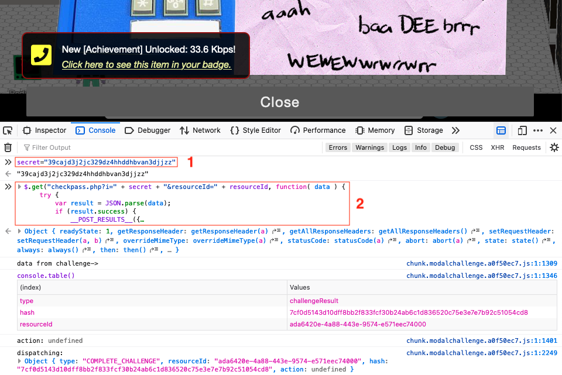

# 33.6kbps

**Elf**: Fitzy Shortstack<br/>
**Direct link**: [dialup website](https://dialup.kringlecastle.com/?challenge=dialup&id=437c36c3-e0c0-4bdf-bf60-2de872223b64)<br/>
**Objective**: [Open HID Lock](../objectives/o5.md)


## Request

!!! quote "Fitzy Shortstack"
    "Put it in the cloud," they said...<br/>
    "It'll be great," they said...<br/>
    All the lights on the Christmas trees throughout the castle are controlled through a remote server.<br/>
    We can shuffle the colors of the lights by connecting via dial-up, but our only modem is broken!<br/>
    Fortunately, I speak dial-up. However, I can't quite remember the handshake sequence.<br/>
    Maybe you can help me out? The phone number is 756-8347; you can use this blue phone.


## Solution

One option to solve this challenge is to iterate through all possible combinations manually. A quicker alternative is to check [`dialup.js`](https://dialup.kringlecastle.com/dialup.js) and see that the script defines an event listener for each button that appends part of a code to a `secret` variable. 

```javascript linenums="1" hl_lines="5"
pickup.addEventListener('click', () => {
  if (phase === 0) {
    phase = 1;
    playPhase();
    secret += '39cajd'
  } else {
    phase = 0;
    playPhase();
  }
});
```

Follow the order defined by the different `phase` boolean condition statements in [`dialup.js`](https://dialup.kringlecastle.com/dialup.js) to recreate the final secret value as `39cajd3j2jc329dz4hhddhbvan3djjzz`. The correct order of events, CSS classes, and JavaScript variables are outlined below.

| Phase | Action              | CSS class            | JS variable      | Secret added   |
| :---- | :------------------ | :------------------- | :--------------- | :------------- |
| 1     | Pickup the receiver | `.pickup`            | `pickup`         | `39cajd`       |
| 2, 3  | Dial 7568347        | `.dtmf0` to `.dtmf9` | `btn0` to `btn9` | -              |
| 4     | "baa DEE brrrr"     | `.respCrEsCl`        | `btnrespCrEsCl`  | `3j2jc`        |
| 5     | "aaah"              | `.ack`               | `ack`            | `329dz`        |
| 6     | "WEWEWEwrwrrwrr"    | `.cm_cj`             | `cm_cj`          | `4hhdd`        |
| 7     | "beDURRdunditty"    | `.l1_l2_info`        | `l1_l2_info`     | `hbvan3`       |
| 8     | "SCHHHRRHHRTHRTR"   | `.trn`               | `trn`            | `djjzz`        |

The script submits the `secret` and a `resourceID` using a HTTP GET request to ensure the challenge is marked completed for the logged in player. To solve the challenge and receive credit in your badge, open a web browser JavaScript console and use `secret="39cajd3j2jc329dz4hhddhbvan3djjzz"` to set the `secret` variable (1). Submit the data by copy/pasting the JQuery GET request found at the end of [`dialup.js`](https://dialup.kringlecastle.com/dialup.js) (2).

{: class=border }

When you take the manual route, you'll hear a female voice stating *Your lights have been updated.* when sending the right sequence. In addition, when selecting the [`SCHHRRHHRTHRTR`](https://dialup.kringlecastle.com/audio/trn.mp3) sound, you'll also be able to enjoy a variation of the famous [Wilhelm scream](../easter_eggs.md#wilhelm-scream) where Wilhelm sounds as if he's being forced through an Espresso maker. :astonished:


## Response

!!! quote "Fitzy Shortstack"
    탢ݵרOُ񆨶$Ԩ؉楌Բ ahem! We did it! Thank you!!<br/>
    Anytime you feel like changing the color scheme up, just pick up the phone!<br/>
    You know, Santa really seems to trust Shinny Upatree...
