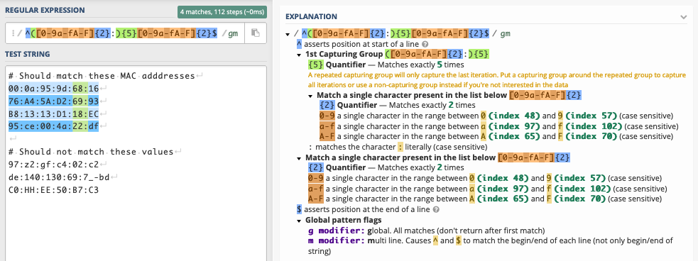
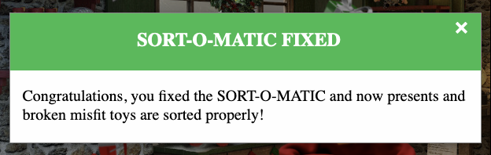

# Sort-o-Matic

**Elf**: Minty Candycane 
**Direct link**: [regex website](https://present-sorter.kringlecastle.com/?challenge=regex&id=c8e3a439-86b1-45c4-9db0-51a21dd6f3e9) 
**Objective**: [Splunk Challenge](../objectives/o6.md)

## Request

!!! quote "Minty Candycane"
    Hey there, KringleCon attendee! I'm Minty Candycane! 
    I'm working on fixing the Present Sort-O-Matic. 
    The Sort-O-Matic uses JavaScript regular expressions to sort presents apart from misfit toys, but it's not working right. 
    With some tools, regexes need / at the beginning and the ends, but they aren't used here. 
    You can find a regular expression cheat sheet [here](https://www.debuggex.com/cheatsheet/regex/javascript) if you need it. 
    You can use [this](https://regex101.com/) regex interpreter to test your regex against the required Sort-O-Matic patterns. 
    Do you think you can help me fix it?

## Hints

??? hint "JavaScript Regex Cheat Sheet"
    Handy quick reference for JS regular expression construction: [https://www.debuggex.com/cheatsheet/regex/javascript](https://www.debuggex.com/cheatsheet/regex/javascript)

??? hint "Regex Practice"
    Here's a place to try out your JS Regex expressions: [https://regex101.com/](https://regex101.com/)

## Solution

The [cheatsheet](https://www.debuggex.com/cheatsheet/regex/javascript) provides really all that's required to complete this challenge. Each question has a popup with examples of what should and should not be matched. Copy each example into [regex101](https://regex101.com/) to verify that the regex pattern works as expected. 

{: class=border }

!!! done "Answers"
    1. Matches at least one digit: `\d{1}`
    2. Matches 3 alpha a-z characters ignoring case: `[a-zA-Z]{3}`
    3. Matches 2 chars of lowercase a-z or numbers: `[a-z0-9]{2}`
    4. Matches any 2 chars not uppercase A-L or 1-5: `[^A-L1-5]{2}`
    5. Matches three or more digits only: `^\d{3,}$`
    6. Matches multiple hour:minute:second time formats only: `^[0-2]?[0-9]:[0-5][0-9]:[0-5][0-9]$`
    7. Matches MAC address format only while ignoring case: `^([0-9a-fA-F]{2}:){5}[0-9a-fA-F]{2}$`
    8. Matches multiple day, month, and year date formats only: `^[0-3]{1}[0-9]{1}[\.\/-]{1}[0-1][0-9][\.\/-]{1}[1-9]{4}$`

## Response

!!! quote "Minty Candycane"
    Great job! You make this look easy! 
    Hey, have you tried the Splunk challenge? 
    Are you newer to SOC operations? Maybe check out his [intro talk](https://www.youtube.com/watch?v=qbIhHhRKQCw) from last year. 
    Dave Herrald is doing a [great talk](https://www.youtube.com/watch?v=RxVgEFt08kU) on tracking adversary emulation through Splunk! 
    Don't forget about useful tools including Cyber Chef for decoding and decrypting data! 
    It's down in the Great Room, but oh, they probably won't let an attendee operate it.

