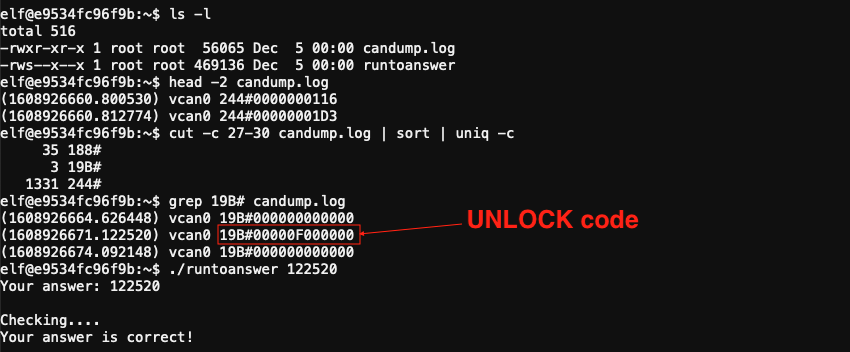

# CAN-Bus Investigation

**Elf**: Wunorse Openslae<br/>
**Direct link**: [canbus terminal](https://docker2020.kringlecon.com/?challenge=canbus&id=104b0e42-dfab-4c26-91da-99ded97b9c03)<br/>
**Objective**: [Solve the Sleigh's CAN-D-BUS Problem](../objectives/o7.md)


## Request

!!! quote "Wunorse Openslae"
    Hiya hiya - I'm Wunorse Openslae!<br/>
    I've been playing a bit with CAN bus. Are you a car hacker?<br/>
    I'd love it if you could take a look at this terminal for me.<br/>
    I'm trying to figure out what the unlock code is in this CAN bus log.<br/>
    When it was grabbing this traffic, I locked, unlocked, and locked the doors one more time.<br/>
    It ought to be a simple matter of just filtering out the noise until we get down to those three actions.<br/>
    Need more of a nudge? Check out Chris Elgee's [talk](https://www.youtube.com/watch?v=96u-uHRBI0I) on CAN traffic!


## Hints

??? hint "CAN Bus Talk"
    Chris Elgee is talking about how [CAN traffic](https://www.youtube.com/watch?v=96u-uHRBI0I) works right now!

??? hint "Filtering Text"
    You can hide lines you don't want to see with commands like `cat file.txt | grep -v badstuff`


## Solution

??? abstract "Welcome message"
    ```text
    MMMMMMMMMMMMMMMMMMMMMMMMMMMMMMMMMMMMMMMMMMMMMMMMMMMMMMMMMMMMMMMMMMMMMMMMMMMMMM
    MMMMMMMMMMMMMMMMMMMMMMMMMMMMMWX00OkxxddcddxxkOO0XWMMMMMMMMMMMMMMMMMMMMMMMMMMMM
    MMMMMMMMMMMMMMMMMMMMMMMWXOxoc:c.;cccccc.ccccc:.:c:ldxOXMMMMMMMMMMMMMMMMMMMMMMM
    MMMMMMMMMMMMMMMMMMMMXkoc',ccccc:.:ccccc.ccccc.;cccc,'::cdOXMMMMMMMMMMMMMMMMMMM
    MMMMMMMMMMMMMMMMM0xc:cccc,':cccc::ccccccccccccccc:.;cccccc:lxXMMMMMMMMMMMMMMMM
    MMMMMMMMMMMMMMNkl,',:ccccc;;ccccccccccccccccccccc::cccccc:,',:lOWMMMMMMMMMMMMM
    MMMMMMMMMMMMNxccccc;';cccccccccccccccccccccccccccccccccc;':cccccckWMMMMMMMMMMM
    MMMMMMMMMMNdcccccc:..;cccccccccccccccccccccccccccccccccccccccccccc:kWMMMMMMMMM
    MMMMMMMMM0c,,,,:cccc;..;cccccccccccccccccccccccccccccccccccccc:,,,;:lKMMMMMMMM
    MMMMMMMWd:cccc;:cccccc;..,cccccccccccccccccccccccccccccccccccc;:cccccckMMMMMMM
    MMMMMMNlcccccccccccccccc:..,:ccccccccccccccccccccccccccccccccccccccccc:oWMMMMM
    MMMMMNc,,,,,:ccccccccccccc:..':cccccccccccccccccccccccccccccccccc:,,,,,;oWMMMM
    MMMMWoccccc::ccccccccccccccc:'.':cccccccccccccccccccccccccccccccc::ccccccxMMMM
    MMMMkccccccccccccccccccccccccc:'..:cccccccccccccccccccccccccccccccccccccc:0MMM
    MMMN::cccccccccccccccccccccccccc:'..:cccccccccccccccccccccccccccccccccccc:cWMM
    MMMk,,,,,:cccccccccccccccccccccccc:,..;ccccccccccccccccccccccccccccc:,,,,,;0MM
    MMMlccccccccccccccccccccccccccccccccc,.;cccccccccccccccccccccccccccccccccccdMM
    MMW:ccccccccccccccccccccccccccccccccccccccccccccccccccccccccccccccccccccccclMM
    MMWOOOOOOOOOOOOOOOOOOOOOOOOOOOOOOOOOOOOOOOOOOOOOOOOOOOOOOOOOOOOOOOOOOOOOOOO0MM
    MMMMMMMMMMMMMMMMMMMMMMMMMMMMMMMMMMMMMMMMMMMMMMMMMMMMMMMMMMMMMMMMMMMMMMMMMMMMMM

    Welcome to the CAN bus terminal challenge!
    In your home folder, there's a CAN bus capture from Santa's sleigh. Some of
    the data has been cleaned up, so don't worry - it isn't too noisy. What you
    will see is a record of the engine idling up and down. Also in the data are
    a LOCK signal, an UNLOCK signal, and one more LOCK. Can you find the UNLOCK?
    We'd like to encode another key mechanism.

    Find the decimal portion of the timestamp of the UNLOCK code in candump.log
    and submit it to ./runtoanswer!  (e.g., if the timestamp is 123456.112233,
    please submit 112233)
    ```

1. Review the first few lines to see what's in the file.
2. The 244 codes appear to be the engine revving activity. Filter those out with `grep -v 244 candump.log`
3. The output contains 3 '19B' codes that are different from the rest, those are the LOCK and UNLOCK codes
4. The timestamp from the middle '19B' code, '122520' is the answer.



```
(1608926660.800530) vcan0 244#0000000116
```

```
head -2 candump.log
cut -c 27-30 candump.log | sort | uniq -c
grep 19B# candump.log
```

## Response

!!! quote "Wunorse Openslae"
    Great work! You found the code!<br/>
    I wonder if I can use this knowledge to work out some kind of universal unlocker...<br/>
    ... to be used only with permission, of course!<br/>
    Say, do you have any thoughts on what might fix Santa's sleigh?<br/>
    Turns out: Santa's sleigh uses a variation of CAN bus that we call CAN-D bus.<br/>
    And there's something naughty going on in that CAN-D bus.<br/>
    The brakes seem to shudder when I put some pressure on them, and the doors are acting oddly.<br/>
    I'm pretty sure we need to filter out naughty CAN-D-ID codes.<br/>
    There might even be some valid IDs with invalid data bytes.<br/>
    For security reasons, only Santa is allowed access to the sled and its CAN-D bus.<br/>
    I'll hit him up next time he's nearby.
