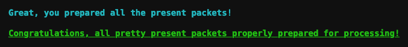

# Scapy Prepper

**Elf**: Alabaster Snowball<br/>
**Direct link**: [scapy terminal](https://docker2020.kringlecon.com/?challenge=scapy&id=6be34f0d-8ae4-41a6-a85b-d50624c5c19c)<br/>
**Objective**: [ARP Shenanigans](../objectives/o9.md)


## Request

!!! quote "Alabaster Snowball"
    Welcome to the roof! Alabaster Snowball here.<br/>
    I'm watching some elves play NetWars!<br/>
    Feel free to try out our Scapy Present Packet Prepper!<br/>
    If you get stuck, you can `help()` to see how to get tasks and hints.


## Solution

??? abstract "Welcome message"
    ```text
    ╔════════════════════════════════════════════════════════════════╗
    ║  ___ ___ ___ ___ ___ _  _ _____   ___  _   ___ _  _____ _____  ║
    ║ | _ \ _ \ __/ __| __| \| |_   _| | _ \/_\ / __| |/ / __|_   _| ║
    ║ |  _/   / _|\__ \ _|| .` | | |   |  _/ _ \ (__| ' <| _|  | |   ║
    ║ |_| |_|_\___|___/___|_|\_| |_|   |_|/_/ \_\___|_|\_\___| |_|   ║
    ║                ___                                             ║
    ║               | _ \_ _ ___ _ __ _ __  ___ _ _                  ║
    ║               |  _/ '_/ -_) '_ \ '_ \/ -_) '_|                 ║
    ║               |_| |_| \___| .__/ .__/\___|_|                   ║
    ║                           |_|  |_|                             ║
    ║                (Packets prepared with scapy)                   ║
    ╚════════════════════════════════════════════════════════════════╝
    Type "yes" to begin.
    ```

Similar to how the [Linux Primer](./h3.md) helps you to learn some common shell commands, this challenge is meant to help you get acquainted with the inner workings of the [Scapy](https://scapy.net/) Python library. Knowing how to use Scapy to inspect and create network packets will become important when solving the [ARP Shenanigans](../objectives/o9.md) challenge.

!!! done "Question 1"
    Welcome to the "Present Packet Prepper" interface! The North Pole could use your help preparing present packets for shipment.<br/>
    Start by running the `task.submit()` function passing in a string argument of 'start'.<br/>
    Type `task.help()` for help on this question.

    ```python
    task.submit('start')
    ```

!!! done "Question 2"
    Submit the class object of the scapy module that sends packets at layer 3 of the OSI model.

    ```python
    task.submit(send)
    ```

!!! done "Question 3"
    Submit the class object of the scapy module that sniffs network packets and returns those packets in a list.

    ```python
    task.submit(sniff)
    ```

!!! done "Question 4"
    Submit the NUMBER only from the choices below that would successfully send a TCP packet and then return the first sniffed response packet to be stored in a variable named `pkt`:

    1. `pkt = sr1(IP(dst="127.0.0.1")/TCP(dport=20))`
    2. `pkt = sniff(IP(dst="127.0.0.1")/TCP(dport=20))`
    3. `pkt = sendp(IP(dst="127.0.0.1")/TCP(dport=20))`

    ```python
    task.submit(1)
    ```

!!! done "Question 5"
    Submit the class object of the scapy module that can read pcap or pcapng files and return a list of packets.

    ```
    task.submit(rdpcap)
    ```

!!! done "Question 6"
    The variable `UDP_PACKETS` contains a list of UDP packets. Submit the NUMBER only from the choices below that correctly prints a summary of `UDP_PACKETS`:
    
    1. `UDP_PACKETS.print()`
    2. `UDP_PACKETS.show()`
    3. `UDP_PACKETS.list()`

    ```python
    task.submit(2)
    ```

!!! done "Question 7"
    Submit only the first packet found in `UDP_PACKETS`.

    ```python
    task.submit(UDP_PACKETS[0])
    ```

!!! done "Question 8"
    Submit only the entire TCP layer of the second packet in `TCP_PACKETS`.

    ```python
    task.submit(TCP_PACKETS[1][TCP])
    ```

!!! done "Question 9"
    Change the source IP address of the first packet found in `UDP_PACKETS` to 127.0.0.1 and then submit this modified packet.

    ```python
    UDP_PACKETS[0][IP].src='127.0.0.1'
    task.submit(UDP_PACKETS[0])
    ```

!!! done "Question 10"
    Submit the password `task.submit('elf_password')` of the user alabaster as found in the packet list `TCP_PACKETS`.
    
    ```python
    TCP_PACKETS.show()

    for x in range(3,7):
        print(TCP_PACKETS[x][Raw].load)

    task.submit('echo')
    ```

!!! done "Question 11"
    The ICMP_PACKETS variable contains a packet list of several icmp echo-request and icmp echo-reply packets. Submit only the ICMP chksum value from the second packet in the `ICMP_PACKETS` list.

    ```python
    task.submit(ICMP_PACKETS[1][ICMP].chksum)
    ```

!!! done "Question 12"
    Submit the number of the choice below that would correctly create a ICMP echo request packet with a destination IP of 127.0.0.1 stored in the variable named `pkt`:
    
    1. `pkt = Ether(src='127.0.0.1')/ICMP(type="echo-request")`
    2. `pkt = IP(src='127.0.0.1')/ICMP(type="echo-reply")`
    3. `pkt = IP(dst='127.0.0.1')/ICMP(type="echo-request")`

    ```python
    task.submit(3)
    ```

!!! done "Question 13"
    Create and then submit a UDP packet with a dport of 5000 and a dst IP of 127.127.127.127. (all other packet attributes can be unspecified).

    ```python
    packet = Ether()/IP(dst='127.127.127.127')/UDP(dport=5000)
    task.submit(packet)
    ```

!!! done "Question 14"
    Create and then submit a UDP packet with a `dport` of 53, a `dst` IP of 127.2.3.4, and is a DNS query with a `qname` of "elveslove.santa". (all other packet attributes can be unspecified).

    ```python
    packet = Ether()/IP(dst='127.2.3.4')/UDP(dport=53)/DNS(qd=DNSQR(qname="elveslove.santa"))
    task.submit(packet)
    ```

!!! done "Question 15"
    The variable `ARP_PACKETS` contains an ARP request and response packets. The ARP response (the second packet) has 3 incorrect fields in the ARP layer. Correct the second packet in `ARP_PACKETS` to be a proper ARP response and then task.`submit(ARP_PACKETS)` for inspection.

    ```python
    ARP_PACKETS[1].show()
    ARP_PACKETS[1][ARP].op=2
    ARP_PACKETS[1][ARP].hwsrc='00:13:46:0b:22:ba'
    ARP_PACKETS[1][ARP].hwdst='00:16:ce:6e:8b:24'
    task.submit(ARP_PACKETS)
    ```

After answering all questions correctly you'll be a certified *Scapy Present Packet Prepper* operator! :thumbsup:



## Response

!!! quote "Alabaster Snowball"
    Great job! Thanks!<br/>
    Those skills might be useful to you later on!<br/>
    I've been trying those skills out myself on this other terminal.<br/>
    I'm pretty sure I can use tcpdump to sniff some packets.<br/>
    Then I'm going to try a machine-in-the-middle attack.<br/>
    Next, I'll spoof a DNS response to point the host to my terminal.<br/>
    Then I want to respond to its HTTP request with something I'll cook up.<br/>
    I'm almost there, but I can't quite get it. I could use some help!<br/>
    For privacy reasons though, I can't let you access this other terminal.<br/>
    I do plan to ask Santa for a hand with it next time he's nearby, though.
