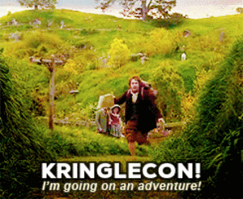

## Introduction

{: align=left }
Hi and welcome to my [2020 SANS Holiday Hack Challenge](https://holidayhackchallenge.com/2020/) write-up. This is now the third time I've had the privilege of traveling to the North Pole to attend KringleCon and help out Santa and the elves in solving all sorts of hacking shennanigans. It has really become one of those event I look forward to with a lot of anticipation each year! :hugging_face: 

There's 3 main sections: this page which contains the introduction, answers, and overall narrative. [Objectives](./objectives/o1.md) contains the write-ups for the main objectives for which an answer had to be submitted and [Terminal hints](./hints/h2.md) has the write-ups for the additional side challenges which provide you with hints to help solve the main objectives.

A few additional things worth pointing out are the [reverse shell](./objectives/o8.md) I was able to obtain on the Broken Tag Generator challenge and the large (but definitely incomplete) list of [Easter eggs](./easter_eggs.md) and references I came across (e.g., Garden Party, the story behind all those landscape paintings, the New Jersy Turnpike exit, Jason is back... twice). Finally, I hope you have as much fun reading this write-up as I had writing it! :smiley:

!!! note "50-page submission limit"
    New this year is the requirement to keep the total write-up length under 50 pages. While I understand there's a huge number of write-ups that need to be reviewed by the SANS and Counter Hack teams, my primary goal for this write-up is to help others learn and be a resource that remains relevant for a long time. I'll do my best to keep the irrelevant banter down to a minimum but there's no cutting corners when it comes to sharing knowledge and learning!


## Navigation

Even with less than 50 pages, there's still quite a bit of information to read through. To make things a little easier, you can use ++"P"++ or ++","++ to go to the previous section, ++"N"++ or ++"."++ to navigate to the next section, and ++"S"++, ++"F"++, or ++"/"++ to open up the search dialog.

!!! tip "Navigation tip"
    If you keep pressing ++"N"++ or ++"."++ from this point forward, you'll hit all the content in the right order! :smile:


## Answers

!!! done "1. Uncover Santa's Gift List - :fontawesome-solid-star::fontawesome-regular-star::fontawesome-regular-star::fontawesome-regular-star::fontawesome-regular-star:"
    Proxmark

!!! done "2. Investigate S3 Bucket - :fontawesome-solid-star::fontawesome-regular-star::fontawesome-regular-star::fontawesome-regular-star::fontawesome-regular-star:"
    North Pole: The Frostiest Place on Earth

!!! done "3. Point-of-Sale Password Recovery - :fontawesome-solid-star::fontawesome-regular-star::fontawesome-regular-star::fontawesome-regular-star::fontawesome-regular-star:"
    santapass

!!! done "4. Operate the Santavator - :fontawesome-solid-star::fontawesome-solid-star::fontawesome-regular-star::fontawesome-regular-star::fontawesome-regular-star:"
    See [this example configuration](./img/objectives/o4/green_activated.png) using the hex nut found in front of the Santavator and the green light bulb found in the Courtyard.

!!! done "5. Open HID Lock - :fontawesome-solid-star::fontawesome-solid-star::fontawesome-regular-star::fontawesome-regular-star::fontawesome-regular-star:"
    Use `lf hid sim -r 2006e22f13` to unlock the door using Shinny Upatree's badge information.

!!! done "6. Splunk Challenge - :fontawesome-solid-star::fontawesome-solid-star::fontawesome-solid-star::fontawesome-regular-star::fontawesome-regular-star:"
    The Lollipop Guild

!!! done "7. Solve the Sleigh's CAN-D-BUS Problem - :fontawesome-solid-star::fontawesome-solid-star::fontawesome-solid-star::fontawesome-regular-star::fontawesome-regular-star:"
    `19B Equals 0000000F2057`

    `080 Less 000000000000`

!!! done "8. Broken Tag Generator - :fontawesome-solid-star::fontawesome-solid-star::fontawesome-solid-star::fontawesome-solid-star::fontawesome-regular-star:"
    JackFrostWasHere

!!! done "9. ARP Shenanigans - :fontawesome-solid-star::fontawesome-solid-star::fontawesome-solid-star::fontawesome-solid-star::fontawesome-regular-star:"
    Tanta Kringle

!!! done "10. Defeat Fingerprint Sensor - :fontawesome-solid-star::fontawesome-solid-star::fontawesome-solid-star::fontawesome-regular-star::fontawesome-regular-star:"
    besanta

!!! done "11. Naughty/Nice List with Blockchain Investigation Part 1 - :fontawesome-solid-star::fontawesome-solid-star::fontawesome-solid-star::fontawesome-solid-star::fontawesome-solid-star:"
    57066318f32f729d

!!! done "12. Naughty/Nice List with Blockchain Investigation Part 2 - :fontawesome-solid-star::fontawesome-solid-star::fontawesome-solid-star::fontawesome-solid-star::fontawesome-solid-star:"
    fff054f33c2134e0230efb29dad515064ac97aa8c68d33c58c01213a0d408afb


## Map & Directory

No matter how hard I'd try, my graphical skills would never be able to do justice to the amazing [ASCII art](https://www.asciiart.eu/) map that's already provided by the [Kringle Kiosk](./hints/h2.md). Without ASCII there'd be no write-up, so it's only appropriate to showcase this artistic gem! Two minor additions to the map are the dark hallway leading to [Santa's portrait](./easter_eggs.md#santas-portrait) and the hidden [Garden Party](./easter_eggs.md#garden-party) area near the courtyard. [Jason](./easter_eggs.md#jason), located next to the bucket on the scaffolding on the front lawn, was added to the directory as well.

=== "Map"

    ```
     __       _    --------------
    |__)_  _ (_   | NetWars Room |
    | \(_)(_)|    |              |
                  |            * |
                   --------------

    __  __                              __  __
     _)|_                                _)|_          -------
    /__|        Tracks                  __)|          |Balcony|
                1 2 3 4 5 6 7                          -------
     -------    -------------                             |
    |Speaker|--| Talks Lobby |                        --------
    |Unprep |  |             |                       |Santa's |
     -------    ------       |                       |Office  |
                      |      |                        --    --
                      |     *|                          |  |
                       ------                           |   ---
                                                        |    * |
        __                ------                         ------
     /||_                |Garden|
      ||                 |Party |
                          ------ 
                            |                     __ __           --------
      --------------------------              /| |_ |_           |Wrapping|
     |        Courtyard         |              |.__)|            |  Room  |
      --------------------------                                  -------- 
        |                    |                                       |
     ------    --------    ------                         ----    --------
    |Dining|--|Kitchen |--|Great |                       |    |--|Workshop|
    |      |   --------   |      |                       |    |  |        |
    | Room |--|      * |--| Room |                       |    |  |        |
    |      |  |Entryway|  |      |                       |    |  |        |
     ------    --------    ------                        | .. |  |        |
                   |                                      ----   | *      |
               ----------                                         --------
              |Front Lawn|       NOTE: * denotes Santavator
               ----------
    ```

=== "Directory"

    !!! tip "Quick tip"
        You can sort the table data by clicking on the table headers.

    | Name                  | Floor | Room                   | Terminal Hint                          |
    | :-------------------- | :---- | : -------------------- | :------------------------------------- | 
    | Ribb Bonbowford       | 1     | Dining Room            | [The Elf C0de](./hints/h10.md)         |
    | Noel Boetie           | 1     | Wrapping Room          | -                                      |
    | Ginger Breddie        | 1     | Castle Entry           | -                                      | 
    | Minty Candycane       | 1.5   | Workshop               | [Sort-o-Matic](./hints/h6.md)          |
    | Angel Candysalt       | 1     | Great Room             | -                                      | 
    | Tangle Coalbox        | 1     | Speaker UNPreparedness | [Snowball Fight](./hints/h11.md)       |
    | Bushy Evergreen       | 2     | Talks Lobby            | [Speaker UNPrep](./hints/h5a.md)       |
    | Holly Evergreen       | 1     | Kitchen                | [Redis Bug Hunt](./hints/h8.md)        |
    | Jason                 | -     | Front Lawn             | -                                      | 
    | Bubble Lightington    | 1     | Courtyard              | -                                      | 
    | Jewel Loggins         | -     | Front Lawn             | -                                      | 
    | Sugarplum Mary        | 1     | Courtyard              | [Linux Primer](./hints/h3.md)          |
    | Pepper Minstix        | -     | Front Lawn             | [Unscape Tmux](./hints/h4.md)          |
    | Bow Ninecandle        | 2     | Talks Lobby            | -                                      | 
    | Morcel Nougat         | 2     | Speaker UNPreparedness | -                                      | 
    | Wunorse Openslae      | R     | NetWars Room           | [CAN-Bus Investigation](./hints/h7.md) |
    | Sparkle Redberry      | 1     | Castle Entry           | -                                      | 
    | Jingle Ringford       | -     | NJTP                   | -                                      | 
    | Piney Sappington      | 1     | Castle Entry           | -                                      | 
    | Chimney Scissorsticks | 2     | Talks Lobby            | -                                      | 
    | Fitzy Shortstack      | 1     | Kitchen                | [33.6kbps](./hints/h5b.md)             |
    | Alabaster Snowball    | R     | NetWars Room           | [Scapy Prepper](./hints/h9.md)         |
    | Eve Snowshoes         | 3     | Santa's Balcony        | -                                      | 
    | Shinny Upatree        | -     | Front Lawn             | [Kringle Kiosk](./hints/h2.md)         |
    | Tinsel Upatree        | 3     | Santa's Office         | -                                      | 


## Conclusion

!!! Abstract "Narrative"
    KringleCon back at the castle, set the stage...

    But it's under construction like my GeoCities page.

    Feel I need a passport exploring on this platform -

    Got half floors with back doors provided that you hack more!

    Heading toward the light, unexpected what you see next:

    An alternate reality, the vision that it reflects.

    Mental buffer's overflowing like a fast food drive-thru trash can.

    Who and why did someone else impersonate the big man?

    You're grepping through your brain for the portrait's "JFS"

    "Jack Frost: Santa," he's the villain who had triggered all this mess!

    Then it hits you like a chimney when you hear what he ain't saying:

    Pushing hard through land disputes, tryin' to stop all Santa's sleighing.

    All the rotting, plotting, low conniving streaming from that skull.

    Holiday Hackers, they're no slackers, returned Jack a big, old null!

We already knew from last year's [narrative](https://n00.be/HolidayHackChallenge2019/#narrative) and [cliffhanger](https://n00.be/HolidayHackChallenge2019/#kringlecon-3) that Jack Frost was in cahoots with the Tooth Fairy, silently working from the shadows. This year we got to unravel his evil plan and actually stop him! Jack Frost not only tried to prevent the expansion of Santa’s Castle but he also gave Santa a magical portrait so he could become him and destroy the holidays! :open_mouth:


!!! quote "Santa"
    Thank you for foiling Jack’s foul plot!

    He sent that magical portrait so he could become me and destroy the holidays!

    Due to your incredible work, you have set everything right and saved the holiday season!

    Congratulations on a job well done!

    Ho Ho Ho!

!!! quote "Jack Frost"
    My plan was NEARLY perfect... but I never expected someone with your skills to come around and ruin my plan for ruining the holidays!

    And now, they’re gonna put me in jail for my deeds.
