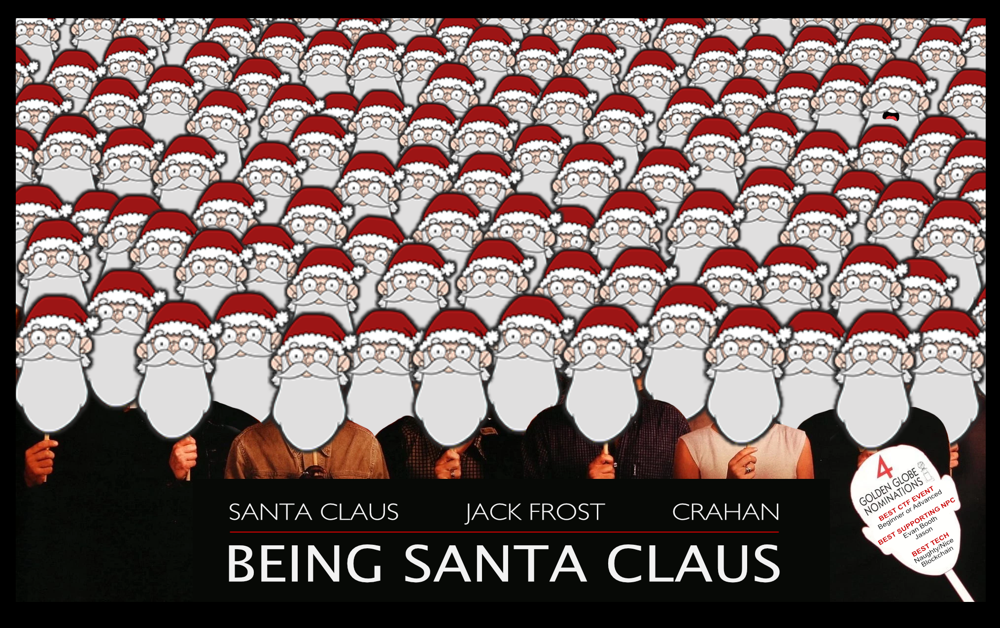

## Introduction

{: align=left }
Hi and welcome to my [2020 SANS Holiday Hack Challenge](https://holidayhackchallenge.com/2020/) write-up. This is now the third time I've had the privilege of traveling to the North Pole to attend [KringleCon](https://2020.kringlecon.com) and help out Santa and the elves with solving all sorts of hacking shennanigans. It has really become the main CTF event I look forward to with a lot of anticipation each year! :hugging_face: 

There's 3 main sections. This page which contains the introduction, answers, and overall narrative. [Objectives](./objectives/o1.md) contains the write-ups for the main objectives for which an answer had to be submitted and [Terminal hints](./hints/h2.md) has the write-ups for the additional side challenges which provide you with hints to help solve the main objectives.

A few additional things worth pointing out are the [reverse shell](./objectives/o8.md#solution) obtained on the Broken Tag Generator challenge, the large but very much incomplete list of [Easter eggs](./easter_eggs.md) (e.g., Garden Party, the story behind all those landscape paintings, the New Jersy Turnpike exit, Jason is back... twice!), and the [custom scripts](https://github.com/crahan/HolidayHackChallenge2020/tree/main/docs/tools) that helped solve some of the challenges.

Finally, I hope you have as much fun reading this write-up as I had writing it! :smiley:

!!! note "50-page submission limit"
    Each year there's a huge number of write-ups that need to be reviewed by the SANS and Counter Hack teams. To find a good middle ground between preventing information overload and creating a write-up that can stand on its own as a learning resource some parts, like the *navigation tip* below, are collapsed by default. Skipping over these will not take away from understanding the overall solution, but feel free to expand them to get some additional information.

??? tip "Navigation tip"
    Even with less than 50 pages, there's still quite a bit of information to read through. To make things a little easier, you can use ++"P"++ or ++","++ to go to the previous section, ++"N"++ or ++"."++ to navigate to the next section, and ++"S"++, ++"F"++, or ++"/"++ to open up the search dialog.

    **TL;DR** if you keep pressing ++"N"++ or ++"."++ from this point forward, you'll hit all the content in the right order! :smile:

## Answers

!!! done "1. Uncover Santa's Gift List - :fontawesome-solid-star::fontawesome-regular-star::fontawesome-regular-star::fontawesome-regular-star::fontawesome-regular-star:"
    Proxmark

!!! done "2. Investigate S3 Bucket - :fontawesome-solid-star::fontawesome-regular-star::fontawesome-regular-star::fontawesome-regular-star::fontawesome-regular-star:"
    North Pole: The Frostiest Place on Earth

!!! done "3. Point-of-Sale Password Recovery - :fontawesome-solid-star::fontawesome-regular-star::fontawesome-regular-star::fontawesome-regular-star::fontawesome-regular-star:"
    santapass

!!! done "4. Operate the Santavator - :fontawesome-solid-star::fontawesome-solid-star::fontawesome-regular-star::fontawesome-regular-star::fontawesome-regular-star:"
    Create a [working configuration](./img/objectives/o4/green_activated.png) using items found in the castle or [bypass](./objectives/o4.md) the stream.

!!! done "5. Open HID Lock - :fontawesome-solid-star::fontawesome-solid-star::fontawesome-regular-star::fontawesome-regular-star::fontawesome-regular-star:"
    Use `lf hid sim -r 2006e22f13` to unlock the door using Shinny Upatree's badge information.

!!! done "6. Splunk Challenge - :fontawesome-solid-star::fontawesome-solid-star::fontawesome-solid-star::fontawesome-regular-star::fontawesome-regular-star:"
    The Lollipop Guild

!!! done "7. Solve the Sleigh's CAN-D-BUS Problem - :fontawesome-solid-star::fontawesome-solid-star::fontawesome-solid-star::fontawesome-regular-star::fontawesome-regular-star:"
    `080 Less 000000000000`

    `19B Equals 0000000F2057`

!!! done "8. Broken Tag Generator - :fontawesome-solid-star::fontawesome-solid-star::fontawesome-solid-star::fontawesome-solid-star::fontawesome-regular-star:"
    JackFrostWasHere

!!! done "9. ARP Shenanigans - :fontawesome-solid-star::fontawesome-solid-star::fontawesome-solid-star::fontawesome-solid-star::fontawesome-regular-star:"
    Tanta Kringle

!!! done "10. Defeat Fingerprint Sensor - :fontawesome-solid-star::fontawesome-solid-star::fontawesome-solid-star::fontawesome-regular-star::fontawesome-regular-star:"
    Use the *besanta* token. The first thing Tinsel Upatree says is *GOSHGOLLY*

!!! done "11a. Naughty/Nice List with Blockchain Investigation Part 1 - :fontawesome-solid-star::fontawesome-solid-star::fontawesome-solid-star::fontawesome-solid-star::fontawesome-solid-star:"
    57066318f32f729d

!!! done "11b. Naughty/Nice List with Blockchain Investigation Part 2 - :fontawesome-solid-star::fontawesome-solid-star::fontawesome-solid-star::fontawesome-solid-star::fontawesome-solid-star:"
    fff054f33c2134e0230efb29dad515064ac97aa8c68d33c58c01213a0d408afb

## Challenges

| Name                  | Floor | Room                   | Terminal Hint                          | Related Objective                               |
| :-------------------- | :---- | : -------------------- | :------------------------------------- | :---------------------------------------------- |
| Jingle Ringford       | -     | NJTP                   | -                                      | [Uncover Santa's Gift List](./objectives/o1.md)                 |
| Shinny Upatree        | -     | Front Lawn             | [Kringle Kiosk](./hints/h2.md)         | [Investigate S3 Bucket](./objectives/o2.md)     |
| Sugarplum Mary        | 1     | Courtyard              | [Linux Primer](./hints/h3.md)          | [PoS Password Recovery](./objectives/o3.md)         |
| Sparkle Redberry      | 1     | Castle Entry           | -                                      | [Operate the Santavator](./objectives/o4.md)        |
| Pepper Minstix        | -     | Front Lawn             | [Unscape Tmux](./hints/h4a.md)         | [Operate the Santavator](./objectives/o4.md)        |
| Ribb Bonbowford       | 1     | Dining Room            | [The Elf C0de](./hints/h4b.md)         | [Operate the Santavator](./objectives/o4.md)        |
| Bushy Evergreen       | 2     | Talks Lobby            | [Speaker UNPrep](./hints/h5a.md)       | [Open HID Lock](./objectives/o5.md)             |
| Fitzy Shortstack      | 1     | Kitchen                | [33.6kbps](./hints/h5b.md)             | [Open HID Lock](./objectives/o5.md)             |
| Angel Candysalt       | 1     | Great Room             | -                                      | [Splunk Challenge](./objectives/o6.md)          |
| Minty Candycane       | 1.5   | Workshop               | [Sort-o-Matic](./hints/h6.md)          | [Splunk Challenge](./objectives/o6.md)          |
| Wunorse Openslae      | R     | NetWars Room           | [CAN-Bus Investigation](./hints/h7.md) | [CAN-D-BUS Problem](./objectives/o7.md)                 |
| Holly Evergreen       | 1     | Kitchen                | [Redis Bug Hunt](./hints/h8.md)        | [Broken Tag Generator](./objectives/o8.md)             |
| Noel Boetie           | 1.5   | Wrapping Room          | -                                      | [Broken Tag Generator](./objectives/o8.md)             |
| Alabaster Snowball    | R     | NetWars Room           | [Scapy Prepper](./hints/h9.md)         | [ARP Shenanigans](./objectives/o9.md)           |
| Tinsel Upatree        | 3     | Santa's Office         | -                                      | [Defeat Fingerprint sensor](./objectives/o10.md)       |
| Tangle Coalbox        | 1     | Speaker UNPreparedness | [Snowball Fight](./hints/h11a.md)       | [Naughty/Nice List Part 1](./objectives/o11a.md) and [Part 2](./objectives/o11b.md)|

## Conclusion

??? Abstract "Narrative"
    KringleCon back at the castle, set the stage...

    But it's under construction like my GeoCities page.

    Feel I need a passport exploring on this platform -

    Got half floors with back doors provided that you hack more!

    Heading toward the light, unexpected what you see next:

    An alternate reality, the vision that it reflects.

    Mental buffer's overflowing like a fast food drive-thru trash can.

    Who and why did someone else impersonate the big man?

    You're grepping through your brain for the portrait's "JFS"

    "Jack Frost: Santa," he's the villain who had triggered all this mess!

    Then it hits you like a chimney when you hear what he ain't saying:

    Pushing hard through land disputes, tryin' to stop all Santa's sleighing.

    All the rotting, plotting, low conniving streaming from that skull.

    Holiday Hackers, they're no slackers, returned Jack a big, old null!

We already knew from last year's [narrative](https://n00.be/HolidayHackChallenge2019/#narrative) and [cliffhanger](https://n00.be/HolidayHackChallenge2019/#kringlecon-3) that Jack Frost was in cahoots with the Tooth Fairy, silently working from the shadows. This year we got to unravel his evil plan and actually stop him! Jack Frost not only tried to prevent the expansion of Santa’s Castle but he also gave Santa a magical portrait so he could become him and destroy the holidays! :open_mouth:

!!! quote "Santa"
    Thank you for foiling Jack’s foul plot!

    He sent that magical portrait so he could become me and destroy the holidays!

    Due to your incredible work, you have set everything right and saved the holiday season!

    Congratulations on a job well done!

    Ho Ho Ho!

!!! quote "Jack Frost"
    My plan was NEARLY perfect... but I never expected someone with your skills to come around and ruin my plan for ruining the holidays!

    And now, they’re gonna put me in jail for my deeds.
