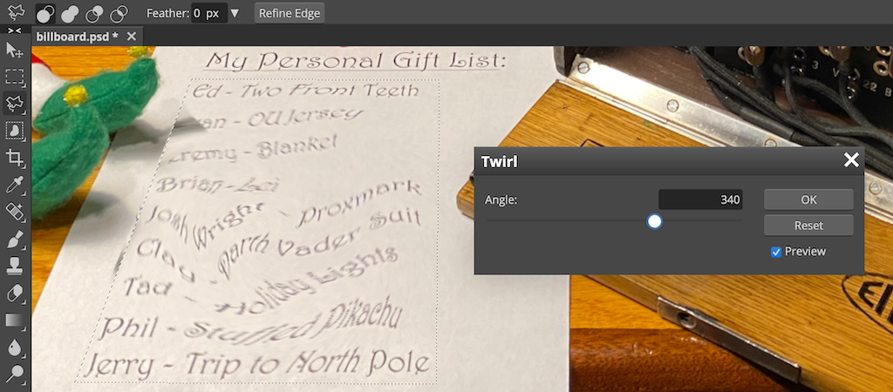

# Uncover Santa's Gift List

**Difficulty**: :fontawesome-solid-star::fontawesome-regular-star::fontawesome-regular-star::fontawesome-regular-star::fontawesome-regular-star: 
**Direct link**: [billboard.png](../artifacts/objectives/o1/billboard.png) 
**Terminal hint**: -

## Objective

!!! question "Objective"
    There is a photo of Santa's Desk on that billboard with his personal gift list. What gift is Santa planning on getting Josh Wright for the holidays? Talk to Jingle Ringford at the bottom of the mountain for advice.

??? quote "Jingle Ringford"
    Oh, and before you head off up the mountain, you might want to try to figure out what's written on that advertising bilboard.

    Have you managed to read the gift list at the center?
    
    It can be hard when things are twirly. There are tools that can help!
    
    It also helps to select the correct twirly area.

## Hints

??? hint "Twirl Area - Jingle Ringford"
    Make sure you Lasso the correct twirly area.

??? hint "Image Edit Tool - Jingle Ringford"
    There are [tools](https://www.photopea.com/) out there that could help Filter the Distortion that is this Twirl.

## Solution

Depending on the image edit, some manipulations are reversible. Download and open the [billboard image](../artifacts/objectives/o1/billboard.png) image in the online [image editing tool](https://www.photopea.com/) Jingle Ringford recommends. Select the area around the scrambled letter and apply a *Twirl* filter with a positive angle value using `Filter` > `Distort` > `Twirl` to unscramble the selected image area.

| Name         | Gift               |
| :----------- | :----------------- |
| Ed           | Two Front Teeth    |
| ?an          | OU Jersey          |
| Jeremy       | Blanket            |
| Brian        | ?                  |
| Josh Wright  | Proxmark           |
| Clay         | Darth Vader Suit   |
| Tad          | Holiday Lights     |
| Phil         | Stuffed Pikachu    |
| Jerry        | Trip to North Pole |

!!! done "Answer"
    Proxmark

!!! Quote "Jingle Ringford"
    Great work with that! I'm sure you'll be able to help us with more challenges up at the castle!
