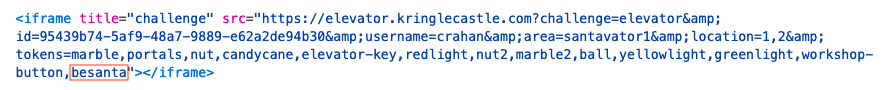
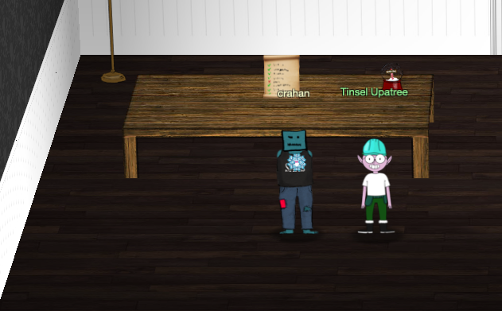

# Defeat Fingerprint Sensor

**Difficulty**: :fontawesome-solid-star::fontawesome-solid-star::fontawesome-solid-star::fontawesome-regular-star::fontawesome-regular-star:<br/>
**Direct link**: [elevator website](https://elevator.kringlecastle.com/?challenge=elevator&id=62341aef-5fd2-4ea6-bdbd-58753ecf2393)<br/>
**Terminal hint**: -


## Objective

!!! question "Request"
    Bypass the Santavator fingerprint sensor - without Santa's fingerprint! What is the first thing Tinsel Upatree says when he sees you in Santa's office?


## Solution

??? info "Updated objective"
    The objective changed slightly during the course of the event. Solving this challenge initially required submitting the answer to the question *What is the first thing Tinsel Upatree says when you enter Santa's office?*. Entering Santa's office as a regular player now also marks the objective completed.

!!! note "Starting point"
    The amount of effort required to bypass the fingerprint sensor and sneak into Santa's office depends on how the Santavator was activated. If the Super Santavator Sparkle Stream [has been bypassed](./o4.md) then all Santavator buttons will be powered on and all that's left is getting past the fingerprint sensor.

    Similarly, if enough items have been picked up to cobble together a [working](../img/objectives/o10/all_activated.png) Super Santavator Sparkle Stream configuration that sends enough of the stream in the right color to each of the receivers, then all buttons will be powered on and the fingerprint sensor is the last remaining hurdle as well.

    An alternative to picking up items around the castle is to manually add them to the Santavator, but because that solution requires similar steps used to bypass the fingerprint sensor itself we'll focus on the fingerprint sensor in this write-up and note where things are applicable to the items as well.

Open up the Santavator [`app.js`](https://elevator.kringlecastle.com/app.js) file and look at `handleBtn4()`. This function handles the button press events for the button to Santa's Office and the fingerprint scanner. There's 2 requirements that need to be met. First, the 3rd floor button needs to be powered on (i.e. have a `powered` CSS class) and `hasToken('besanta')` needs to return *true* (line 7).

```javascript linenums="1" hl_lines="6"
const handleBtn4 = () => {
  const cover = document.querySelector('.print-cover');
  cover.classList.add('open');

  cover.addEventListener('click', () => {
    if (btn4.classList.contains('powered') && hasToken('besanta')) {
      $.ajax({
        type: 'POST',
        url: POST_URL,
        dataType: 'json',
        contentType: 'application/json',
        data: JSON.stringify({ 
          targetFloor: '3',
          id: getParams.id,
        }),
        success: (res, status) => {
          if (res.hash) {
            __POST_RESULTS__({
              resourceId: getParams.id || '1111',
              hash: res.hash,
              action: 'goToFloor-3',
            });
          }
        }
      });
    } else {
      __SEND_MSG__({
        type: 'sfx',
        filename: 'error.mp3',
      });
    }
  });
};
```

The `hasToken()` function is not only used with the *besanta* value but is also called throughout the code with values that reference the items you can pick up around the castle (e.g., *marble*, *portals*, *ball*, *yellowlight*). The function definition can be found near the top of [`app.js`](https://elevator.kringlecastle.com/app.js) and checks if a parsed `tokens` URL parameter (line 2) contains a particular token name (line 6). 

```javascript linenums="1" hl_lines="2 6"
const getParams = __PARSE_URL_VARS__();
let tokens = (getParams.tokens || '').split(',');
document.body.classList = tokens.join(' ');
// document.body.classList = [ ...tokens, 'open' ].join(' ');

const hasToken = name => tokens.indexOf(name) !== -1;
```

By manually adding *besanta* to the challenge `tokens` URL parameter we can now force `hasToken('besanta')` to return *true*. If the button to Santa's Office is powered on as well this will ensure that both `handleBtn4()` requirements are met and the fingerprint scanner can then be bypassed by clicking on the scanner image.

{: class=border }

!!! note "Manually adding items"
    The same technique can be used for adding items to the circuitboard by updating the `tokens` URL parameter with any of the following values: *candycane*, *marble*, *marble2*, *nut*, *nut2*, *redlight*, *yellowlight*, *greenlight*, *portals*, *ball*. The items can then be used to help split and redirect the stream to the different receivers and build a [working configuration](../img/objectives/o10/all_activated.png). *elevator-key* and *workshop-button* can also be specified to add the panel key and missing button, respectively.

    The quickest way to power on any of the panel buttons however is by [bypassing](./o4.md) the Super Santavator Sparkle Stream.

Head to Santa's Office on the 3rd floor and talk to Tinsel Upatree.

{: class=border }

!!! quote "Tinsel Upatree"
    GOSHGOLLY<br/>
    How did you get in here??<br/>
    I mean, hey, I'm impressed you made it in here, but you've got to leave!<br/>
    Breaking into Santa's office might mean immediate membership on the wrong side of the Naughty/Nice List.

!!! done "Answer"
    GOSHGOLLY
