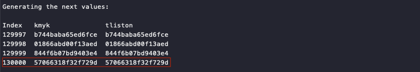

# Naughty/Nice List with Blockchain Investigation Part 1

**Difficulty**: :fontawesome-solid-star::fontawesome-solid-star::fontawesome-solid-star::fontawesome-solid-star::fontawesome-solid-star:<br/>
**Direct link**: [blockchain.dat](https://download.holidayhackchallenge.com/2020/blockchain.dat)<br/>
**Terminal hint**: [Snowball Fight](../hints/h11a.md)


## Objective

!!! question "Request"
    Even though the chunk of the blockchain that you have ends with block 129996, can you predict the nonce for block 130000? Talk to Tangle Coalbox in the Speaker UNpreparedness Room for tips on prediction and Tinsel Upatree for more tips and [tools](https://download.holidayhackchallenge.com/2020/OfficialNaughtyNiceBlockchainEducationPack.zip). (Enter just the 16-character hex value of the nonce)

??? quote "Tinsel Upatree"
    Howdy Santa! Just guarding the Naughty/Nice list on your desk.<br/>
    Santa, I don't know if you've heard, but something is very, very wrong...<br/>
    We tabulated the latest score of the Naughty/Nice Blockchain.<br/>
    Jack Frost is the nicest being in the world! Jack Frost!?!<br/>
    As you know, we only really start checking the Naughty/Nice totals as we get closer to the holidays.<br/>
    Out of nowhere, Jack Frost has this crazy score... positive 4,294,935,958 nice points!<br/>
    No one has EVER gotten a score that high! No one knows how it happened.<br/>
    Most of us recall Jack having a NEGATIVE score only a few days ago...<br/>
    Worse still, his huge positive score seems to have happened way back in March.<br/>
    Our first thought was that he somehow changed the blockchain - but, as you know, that isn't possible.<br/>
    We ran a validation of the blockchain and it all checks out.<br/>
    Even the smallest change to any block should make it invalid.<br/>
    Blockchains are huge, so we cut a one minute chunk from when Jack's big score registered back in March.<br/>
    You can get a slice of the Naughty/Nice blockchain on your desk.<br/>
    You can get some [tools to help you here](https://download.holidayhackchallenge.com/2020/OfficialNaughtyNiceBlockchainEducationPack.zip).<br/>
    Tangle Coalbox, in the Speaker UNPreparedness room. has been talking with attendees about the issue.


## Hints

??? hint "MD5 Hash Collisions"
    If you have control over to bytes in a file, it's easy to create MD5 [hash collisions](https://github.com/corkami/collisions). Problem is: there's that nonce that he would have to know ahead of time.


## Solution

Predicting the nonce for block 130000 requires recreating or cloning the state of the Mersenne Twister pseudo random number generator (PRNG) that was originally used to generate the nonce values in the blockchain.

To do this we require a few things. As Santa, grab the [`blockchain.dat`](https://download.holidayhackchallenge.com/2020/blockchain.dat) file from the desk in your office. We also need the `naughty_nice.py` script from the [official Naughty/Nice Blockchain education pack](https://download.holidayhackchallenge.com/2020/OfficialNaughtyNiceBlockchainEducationPack.zip) so we can load the `blockchain.dat` file and extract the nonces. Finally, grab a copy of Tom Liston's [`mt19937.py`](https://github.com/tliston/mt19937) script that will allow us to clone a Mersenne Twister PRNG.

!!! note "Two libraries, same outcome"
    Tom Liston's [`mt19937.py`](https://github.com/tliston/mt19937) script is an implementation of a 32-bit MT19937 PRNG. The nonces in the `blockchain.dat` file however are 64-bit integers. A little bit of extra work is required to first convert the 64-bit nonces to 32-bit integers.
    
    An alternative 32-bit Mersenne Twister Python implementation which already supports multiples of 32-bit integer sizes is Kimiyuki Onaka's [mersenne-twister-predictor](https://github.com/kmyk/mersenne-twister-predictor) library. The final [`generate_nonce.py`](../tools/objectives/o11a/generate_nonce.py) script solves the challenge using both libraries to help explain how a 32-bit Mersenne Twister PRNG state can be recreated using 64-bit integers and how we can then use the 32-bit PRNG to predict the next 64-bit values.

Open the `blockchain.dat` file (line 3) and read all the nonce values into a list (lines 12-13).

```python linenums="1" hl_lines="3 12-13"
if __name__ == '__main__':
    # load the blockchain file
    c2 = Chain(load=True, filename='blockchain.dat')

    # print some blockchain stats
    print(f'The chain contains {len(c2.blocks)} blocks')
    print(f'First block has index {c2.blocks[0].index}')
    print(f'Last block has index {c2.blocks[-1].index}')
    
    # get the nonce values from the blocks
    nonce_list = []
    for block in c2.blocks:
        nonce_list.append(block.nonce)
```

Create two MT19937 PRNGs. One using [Kimiyuki Onaka's library](ttps://github.com/kmyk/mersenne-twister-predictor) (`kmyk`) and one based on [Tom's sample code](https://github.com/tliston/mt19937) (`tliston`).

```python linenums="1"
    # create a kmyk MT19937 PRNG predictor 
    # https://github.com/kmyk/mersenne-twister-predictor
    kmyk = MT19937Predictor()

    # create a Tom Liston MT19937 PRNG predictor 
    # https://github.com/tliston/mt19937
    tliston = mt19937(0)
```

The internal state of a 32-bit Mersenne Twister is tracked using an array of 624 32-bit integer values. Because we can split our 64-bit nonce values into two 32-bit parts we need at least 312 64-bit nonces to recreate the internal state of the PRNG. For `kmyk` this 64-bit to 32-bit conversion is handled behind the scenes and we just need to specify the bit size as a parameter (line 3).

For the `tliston` implementation we need to split the 64-bit nonce into two 32-bit integers ourselves before sending each part through the PRNG's `untemper()` function. The first 32-bit integer is simply the lower 32 bits of the 64-bit nonce (line 9). The second 32-bit integer is created by right-shifting the upper half of the nonce by 32 bits (line 11). 

```python linenums="1" hl_lines="3 9 11"
    # use all but the final 5 nonces for kmyk
    for nonce in nonce_list[:-5]:
        kmyk.setrandbits(nonce, 64)

    # use 312 64-bit nonces, excluding the final 5, for tliston
    idx = 0
    for nonce in nonce_list[-317:-5]:
        # least significant 32-bit
        tliston.MT[idx] = untemper(nonce & 0xFFFFFFFF)
        # most significant 32-bit
        tliston.MT[idx+1] = untemper((nonce >> 32) & 0xFFFFFFFF)
        idx += 2
```

We don't use the final 5 nonce values to clone the PRNG because we need something to compare our predicted values against. Generating the next 5 numbers using `kmyk` (line 8) and `tliston` (line 10) should match the last 5 `blockchain.dat` nonces.

```python linenums="1" hl_lines="8 10"
    # generate the next 5 values and compare them to the final 5 in the blockchain
    print('\nVerifying correctness using the last 5 blockchain nonces:')
    print('\nIndex   kmyk              tliston           Blockchain        Check')
    for i in range(5):
        # blockchain verification value
        nonce_next = nonce_list[-5+i]
        # next kmyk value
        kmyk_next = kmyk.getrandbits(64)
        # next tliston value
        tliston_next = extract_number_64(tliston)
        # comparison table
        print('%i  %16.16x  %16.16x  %16.16x  %r' % (
            c2.blocks[-5+i].index,
            kmyk_next,
            tliston_next,
            nonce_next,
            (kmyk_next == tliston_next == nonce_next)
        ))
        assert(kmyk_next == tliston_next == nonce_next)
```

!!! info "Generating 64-bit random numbers"
    To use a 32-bit Mersenne Twister PRNG to generate a 64-bit integer, generate two 32-bit random numbers and combine them together into a 64-bit value by using the reverse process used for splitting a 64-bit number into two 32-bit values. This is exactly what the `extract_number_64()` function does.

    ```python linenums="1"
    def extract_number_64(tliston):
        # grab 2 32-bit random values
        next1 = tliston.extract_number()
        next2 = tliston.extract_number()
        # transform them into a 64-bit value
        bytes = bytearray()
        bytes += next2.to_bytes(4, byteorder='big')
        bytes += next1.to_bytes(4, byteorder='big')
        return int.from_bytes(bytes, byteorder='big')
    ```

Run the [`generate_nonce.py`](../tools/objectives/o11a/generate_nonce.py) script to verify that everything is working as intended.


The 5 generated values from both cloned PRNGs match up with the 5 final nonce values from the `blockchain.dat` file. The final part of the script uses the `kmyk` (line 6) and `tliston` (line 8) PRNGs to predict the next 4 nonces up to block 130000.

```python linenums="1" hl_lines="6 8"
    # predict the next 4 random values
    print('\nGenerating the next values:')
    print('\nIndex   kmyk              tliston')
    for i in range(4):
        # kmyk answer
        kmyk_next = kmyk.getrandbits(64)
        # tliston answer
        tliston_next = extract_number_64(tliston)
        # prediction table
        print('%i  %16.16x  %16.16x' % (
            c2.blocks[-1].index + i + 1,
            kmyk_next,
            tliston_next,
        ))
```



!!! done "Answer"
    57066318f32f729d
