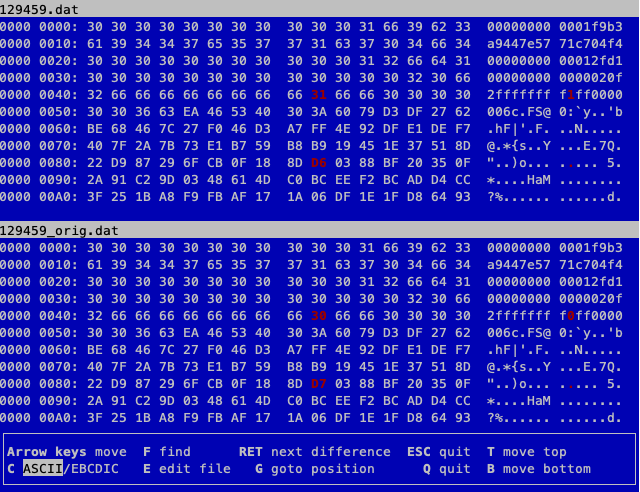

# Naughty/Nice List with Blockchain Investigation Part 2

**Difficulty**: :fontawesome-solid-star::fontawesome-solid-star::fontawesome-solid-star::fontawesome-solid-star::fontawesome-solid-star:<br/>
**Direct link**: [blockchain.dat](../artifacts/objectives/o11a/blockchain.dat)<br/>
**Terminal hint**: [Snowball Fight](../hints/h11a.md)


## Objective

!!! question "Request"
    The SHA256 of Jack's altered block is: 58a3b9335a6ceb0234c12d35a0564c4e f0e90152d0eb2ce2082383b38028a90f. If you're clever, you can recreate the original version of that block by changing the values of only 4 bytes. Once you've recreated the original block, what is the SHA256 of that block?


## Hints

??? hint "Imposter Block Event"
    Shinny Upatree swears that he doesn't remember writing the contents of the document found in that block. Maybe looking closely at the documents, you might find something interesting.

??? hint "Unique Hash Collision - Tangle Coalbox"
    If Jack was somehow able to change the contents of the block AND the document without changing the hash... that would require a very [UNIque hash COLLision](https://github.com/cr-marcstevens/hashclash).

??? hint "Blockchain ... Chaining - Tangle Coalbox"
    A blockchain works by "chaining" blocks together - each new block includes a hash of the previous block. That previous hash value is included in the data that is hashed - and that hash value will be in the next block. So there's no way that Jack could change an existing block without it messing up the chain...

??? hint "Minimal Changes - Tangle Coalbox"
    Apparently Jack was able to change just 4 bytes in the block to completely change everything about it. It's like some sort of [evil game](https://speakerdeck.com/ange/colltris) to him.

??? hint "Block Investigation - Tangle Coalbox"
    The idea that Jack could somehow change the data in a block without invalidating the whole chain just collides with the concept of hashes and blockchains. While there's no way it could happen, maybe if you look at the block that seems like it got changed, it might help.

??? hint "Blockchain Talk - Tangle Coalbox"
    Qwerty Petabyte is giving [a talk](https://www.youtube.com/watch?v=7rLMl88p-ec) about blockchain tomfoolery!


## Solution

!!! note "Understanding the Naughty/Nice Blockchain format"
    Professor Qwerty Petabyte [explains the architecture](https://www.youtube.com/watch?v=7rLMl88p-ec) and technical background of the Naughty/Nice Blockchain in great detail but two key points to remember are (1) that each block in the blockchain contains the MD5 hash of the previous signed block data (i.e., block data + signature) and (2) that the signature is created based on the MD5 of the block data.


### Dumping the block

Before determining what exactly happened to Jack's altered block we first need to find it and save the signed block data to a file. Grab the [`blockchain.dat`](https://download.holidayhackchallenge.com/2020/blockchain.dat) file from the desk in Santa's office and the `naughty_nice.py` script from the [official Naughty/Nice Blockchain education pack](https://download.holidayhackchallenge.com/2020/OfficialNaughtyNiceBlockchainEducationPack.zip). We need the latter to read the `blockchain.dat` file and export block data to a file.

Use [`dump_blocks.py`](../tools/objectives/o11b/dump_block.py) to load the `blockchain.dat` file, find the block with the matching SHA256 value, print the block details, and save the signed block data and any attached documents to [`129459.dat`](../artifacts/objectives/o11b/129459.dat), [`129459.pdf`](../artifacts/objectives/o11b/129459.pdf), and [`129459.bin`](../artifacts/objectives/o11b/129459.bin).

```text linenums="1" hl_lines="6-7 13-15"
Chain Index: 129459
              Nonce: a9447e5771c704f4
                PID: 0000000000012fd1
                RID: 000000000000020f
     Document Count: 2
              Score: ffffffff (4294967295)
               Sign: 1 (Nice)
         Data item: 1
               Data Type: ff (Binary blob)
             Data Length: 0000006c
                    Data: b'ea465340303a6079d3df2762be68467c27f...'
         Data item: 2
               Data Type: 05 (PDF)
             Data Length: 00009f57
                    Data: b'255044462d312e330a2525c1cec7c5210a0...'
               Date: 03/24
               Time: 13:21:41
       PreviousHash: 4a91947439046c2dbaa96db38e924665
  Data Hash to Sign: 347979fece8d403e06f89f8633b5231a
          Signature: b'MJIxJy2iFXJRCN1EwDsqO9NzE2Dq1qlvZuFFlljm...'
```

The block data contains the highest possible nice score (lines 6-7) and a [glowing PDF report](../artifacts/objectives/o11b/129459.pdf) about Jack Frost (lines 13-15). Any tampering with the blockchain should cause a verification failure, which it doesn't. It seems like the MD5 hash of the unsigned block data, the signature, and the md5 hash of the signed block data didn't change at all. More on that later.

The objective also mentions that only 4 bytes were modified. The `sign` field, which indicates if the score is naughty or nice, only takes up 1 byte. Replacing a whole PDF file would requires far more than the remaining 3 bytes.


### Manipulating the PDF

In reality, the PDF document wasn't replaced at all. It [already contained](https://github.com/corkami/collisions#pdf) both the [scathing report](../artifacts/objectives/o11b/129459_orig.pdf) and its [glowing alternative](../artifacts/objectives/o11b/129459.pdf) prior to being added to the blockchain. You can toggle between both versions by changing the object the PDF catalog points to. The default value of *2* will display the nice content. Changing the value to *3* will render the PDF starting from a different object tree and show the original report which is far less positive. :smirk:

=== "Modified PDF"
    {: class=border }

=== "Original PDF"
    {: class=border }


### Enter... hash collissions!

While it's now clear what was changed, we still need to find 2 of the 4 modified bytes and explain how changing the `sign` from *0* to *1* and the PDF catalog from *3* to *2* didn't change the MD5 hash of the data, triggering a verification failure of the blockchain as a result. That's where hash collisions, and more specifically [UniColl](https://speakerdeck.com/ange/colltris?slide=101), come into the picture.

{: class=border }

Using a UniColl hash collision, 2 sets of data can be created which share the same MD5 yet differ by 2 bytes. While the location of these 2 bytes is predefined (i.e. the 10th char of the prefix and the 10th char of the 2nd block) adding redundant data to the prefix ensures the data we want to modify neatly aligns with the location of the first byte. That's why the PDF catalog entry is set to `<</Type/Catalog/_Go_Away/Santa/Pages 2 0 R` instead of `<</Type/Catalog/Pages 2 0 R`. The `_Go_Away/Santa/` part was added to align the catalog reference with the first collision byte. Jack got lucky with the `sign` value as the block's data structure puts that byte in the expected location out of the box. :smile:

A second important characteristic of a UniColl hash collision is that the way both bytes change is predefined as well. The 10th byte of the prefix will either be +1 or -1, while the 10th byte of the second block will change by the same amount but in the other direction. In other words, increasing `sign` from 0 to 1 requires the 10th byte of the second block to decrease by 1.


### Recreating the original block

We can now modify the signed data block we extracted from the blockchain and revert it to the state it was in when Shinny Upatree was tricked into adding Jack's tampered PDF to the blockchain. The below images show the locations and values of the 2 collision bytes for both the `sign` field and the PDF catalog entry. The tampered version of the signed block data (i.e., [`129459.dat`](../artifacts/objectives/o11b/129459.dat)) is shown at the top while the pre-tamper original is shown on the bottom (i.e., [`129459_orig.dat`](../artifacts/objectives/o11b/129459_orig.dat)).

=== "First UniColl collision (sign)"
    

=== "Second UniColl collision (PDF catalog)"
    

!!! note "What about the signature?"
    Because of the UniColl hash collisions the MD5 hash of the unsigned block data remains the same regardless of the the 4-byte change. This causes the signature to remain valid as it's created using the MD5 hash of the unsigned block data. As the signature is [appended at the end](https://speakerdeck.com/ange/colltris?slide=79) of the unsigned block data, the MD5 of the signed block data (which is stored as part of the next block in the chain) remains the same as well.

Finally, calculate the SHA256 of the original signed block data.


!!! done "Answer"
    fff054f33c2134e0230efb29dad515064ac97aa8c68d33c58c01213a0d408afb
