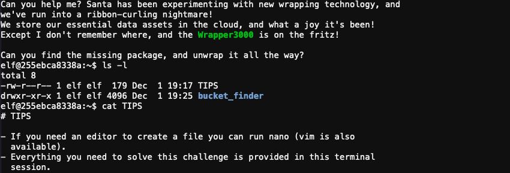
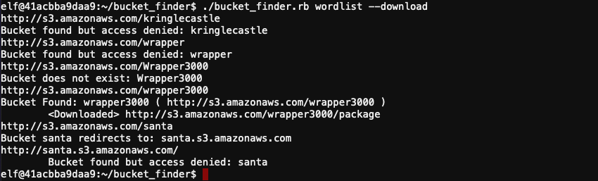

# Investigate S3 Bucket

**Difficulty**: :fontawesome-solid-star::fontawesome-regular-star::fontawesome-regular-star::fontawesome-regular-star::fontawesome-regular-star:<br/>
**Direct link**: [awsbucket terminal](https://docker2020.kringlecon.com/?challenge=awsbucket&id=96995b67-dbee-4245-a5c0-ee33f7e0a54d)<br/>
**Terminal hint**: [Kringle Kiosk](../hints/h2.md)


## Objective

!!! question "Objective"
    When you unwrap the over-wrapped file, what text string is inside the package? Talk to Shinny Upatree in front of the castle for hints on this challenge.

??? quote "Shinny Upatree"
    Say, we've been having an issue with an Amazon S3 bucket.

    Do you think you could help find Santa's package file?
    
    Jeepers, it seems there's always a leaky bucket in the news. You'd think we could find our own files!
    
    Digininja has a great guide, if you're new to S3 searching.
    
    He even released a tool for the task - what a guy!
    
    The package wrapper Santa used is reversible, but it may take you some trying.
    
    Good luck, and thanks for pitching in!


## Hints

??? hint "Find Santa's Package - Shinny Upatree"
    Find Santa's package file from the cloud storage provider. Check Josh Wright's [talk](https://www.youtube.com/watch?v=t4UzXx5JHk0) for more tips!

??? hint "Santa's Wrapper3000 - Shinny Upatree"
    Santa's Wrapper3000 is pretty buggy. It uses several compression tools, binary to ASCII conversion, and other tools to wrap packages.

??? hint "Finding S3 Buckets - Shinny Upatree"
    Robin Wood wrote up a guide about [finding these open S3 buckets](https://digi.ninja/blog/whats_in_amazons_buckets.php).

??? hint "Leaky AWS S3 Buckets - Shinny Upatree"
    It seems like there's a new story every week about data exposed through unprotected [Amazon S3 buckets](https://www.computerweekly.com/news/252491842/Leaky-AWS-S3-bucket-once-again-at-centre-of-data-breach).

??? hint "Bucket_finder.rb - Shinny Upatree"
    He even wrote a tool to [search for unprotected buckets](https://digi.ninja/projects/bucket_finder.php)!

## Solution



!!! info "Updated greeting"
    During the event the message displayed when opening the terminal was updated with some additional hints.

    ```
    Hints: Use the file command to identify a file type. You can also examine
    tool help using the man command. Search all man pages for a string such as
    a file extension using the apropos command.

    To see this help again, run cat /etc/motd.
    ```

First we need to find the S3 bucket that contains Santa's package file. Navigate to the `bucket_finder` folder which contains a `bucket_finder.rb` script and a sample `wordlist` with some sample bucket names. Running `bucket_finder.rb wordlist` will find some buckets, but none will be publicly accessible.


The message that's displayed when you first connect to the terminal conveniently highlights the *Wrapper3000* string, so add that to the `wordlist` file and execute the command `bucket_finder.rb wordlist --download`. This will not only check for publicly accessible S3 buckets matching the strings specified in the `wordlist` file, but it'll also download any files it comes across.

!!! caution "Be nice!"
    During the event the `bucket_finder.rb` script was updated to limit the number of entries in the wordlist to 50.

    ```
    HO HO HO
    The people at AWS are on the nice list this year! You shouldn't use such a long
    wordlist. Use the hints in the description for this challenge to help choose a
    small wordlist to find the missing bucket! Run 'cat /etc/motd' to see it again.
    SANTA
    ```



Now that the `package` file has been [downloaded](../artifacts/objectives/o2/package.txt) to `/home/elf/bucket_finder/wrapper3000/package`, we can start the process of unpacking it. We first need to determine the file type though. Run `file package` which will tell you the contents of the file is *ASCII text, with very long lines*. `cat package` will show you the contents.

!!! abstract "/home/elf/bucket_finder/wrapper3000/package"
    ```
    UEsDBAoAAAAAAIAwhFEbRT8anwEAAJ8BAAAcABwAcGFja2FnZS50eHQuWi54ei54eGQudGFyLmJ6MlVUCQADoBfKX6AXyl91eAsAAQT2AQAABBQAAA
    BCWmg5MUFZJlNZ2ktivwABHv+Q3hASgGSn//AvBxDwf/xe0gQAAAgwAVmkYRTKe1PVM9U0ekMg2poAAAGgPUPUGqehhCMSgaBoAD1NNAAAAyEmJpR5
    QGg0bSPU/VA0eo9IaHqBkxw2YZK2NUASOegDIzwMXMHBCFACgIEvQ2Jrg8V50tDjh61Pt3Q8CmgpFFunc1Ipui+SqsYB04M/gWKKc0Vs2DXkzeJmik
    tINqjo3JjKAA4dLgLtPN15oADLe80tnfLGXhIWaJMiEeSX992uxodRJ6EAzIFzqSbWtnNqCTEDML9AK7HHSzyyBYKwCFBVJh17T636a6YgyjX0eE0I
    sCbjcBkRPgkKz6q0okb1sWicMaky2Mgsqw2nUm5ayPHUeIktnBIvkiUWxYEiRs5nFOM8MTk8SitV7lcxOKst2QedSxZ851ceDQexsLsJ3C89Z/gQ6X
    n6KBKqFsKyTkaqO+1FgmImtHKoJkMctd2B9JkcwvMr+hWIEcIQjAZGhSKYNPxHJFqJ3t32Vjgn/OGdQJiIHv4u5IpwoSG0lsV+UEsBAh4DCgAAAAAA
    gDCEURtFPxqfAQAAnwEAABwAGAAAAAAAAAAAAKSBAAAAAHBhY2thZ2UudHh0LloueHoueHhkLnRhci5iejJVVAUAA6AXyl91eAsAAQT2AQAABBQAAA
    BQSwUGAAAAAAEAAQBiAAAA9QEAAAAA
    ```

Looks like we're dealing with [BASE64](https://en.wikipedia.org/wiki/Base64)-encoded data which gives us our starting point. Since we can't be sure what the output of the decoded data will be, we will redirect the output to a file instead of the console using `cat package | base64 -d > package2`. From this point forward we repeat the process of identifying the file format and unpacking.

| #  | Input file                     | File type                                                      | Unpack command                                   |
| :- | :----------------------------- | :------------------------------------------------------------- | :------------------------------------------------|
| 1  | `package`                      | [BASE64](https://en.wikipedia.org/wiki/Base64)                 | `cat package | base64 -d > package2`             |
| 2  | `package2`                     | [ZIP archive](https://en.wikipedia.org/wiki/ZIP_(file_format)) | `unzip package2`                                 |
| 3  | `package.txt.Z.xz.xxd.tar.bz2` | [bzip2 archive](https://en.wikipedia.org/wiki/Bzip2)           | `bunzip2 package.txt.Z.xz.xxd.tar.bz2`           |
| 4  | `package.txt.Z.xz.xxd.tar`     | [tar archive](https://en.wikipedia.org/wiki/Tar_(computing))   | `tar xf package.txt.Z.xz.xxd.tar`                |
| 5  | `package.txt.Z.xz.xxd`         | [Hex dump](https://en.wikipedia.org/wiki/Hex_dump)             | `xxd -r package.txt.Z.xz.xxd > package.txt.Z.xz` |
| 6  | `package.txt.Z.xz`             | [xz archive](https://en.wikipedia.org/wiki/XZ_Utils)           | `xz -d package.txt.Z.xz`                         |
| 7  | `package.txt.Z`                | [compress'd data](https://en.wikipedia.org/wiki/Compress)      | `uncompress package.txt.Z`                       |

Finally, after 7 steps, `cat package.txt` gives us the answer. :thumbsup:

!!! done "Answer"
    North Pole: The Frostiest Place on Earth
