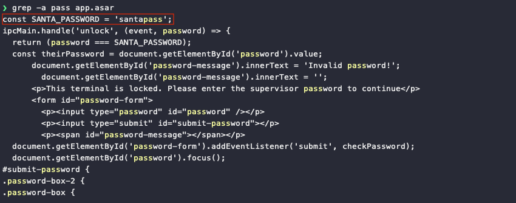

# Point-of-Sale Password Recovery

**Difficulty**: :fontawesome-solid-star::fontawesome-regular-star::fontawesome-regular-star::fontawesome-regular-star::fontawesome-regular-star: 
**Direct link**: [santashop website](https://download.holidayhackchallenge.com/2020/santa-shop/?challenge=santashop&id=54acdeec-8f9c-4288-94d5-dcd1e00ac63f) 
**Terminal hint**: [Linux Primer](../hints/h3.md)

## Objective

!!! question "Request"
    Help Sugarplum Mary in the Courtyard find the supervisor password for the point-of-sale terminal. What's the password?

??? quote "Sugarplum Mary"
    Hey, wouldja' mind helping me get into my point-of-sale terminal? 
    It's down, and we kinda' need it running. 
    Problem is: it is asking for a password. I never set one! 
    Can you help me figure out what it is so I can get set up? 
    Shinny says this might be an Electron application.

## Hints

??? hint "Electron ASAR Extraction"
    There are [tools](https://www.npmjs.com/package/asar) and [guides](https://medium.com/how-to-electron/how-to-get-source-code-of-any-electron-application-cbb5c7726c37) explaining how to extract ASAR from Electron apps.

??? hint "Electron Applications"
    *It's possible to extract the source code from an [Electron](https://www.electronjs.org/) app.

## Solution

 Download the [santa-shop.exe](../artifacts/objectives/o3/santa-shop.exe) binary using the link provided on the [santa-shop](https://download.holidayhackchallenge.com/2020/santa-shop/?challenge=santashop&id=54acdeec-8f9c-4288-94d5-dcd1e00ac63f) website. The `file` command tells us it's a Windows executable (thanks Captain Obvious) and a *Nullsoft Installer self-extracting archive*, which means we can extract the contents using pretty much any capable archive manager. [7-Zip](https://www.7-zip.org/) on Windows, [Engrampa](https://github.com/mate-desktop/engrampa) on Kali Linux, and [The Unarchiver](https://theunarchiver.com/) on macOS all work. Inside the binary you'll find a 7-zip archive named `app-64.7z`. Extract that as well.

The `app.assar` archive file is what we're looking for. While the hints provided by Sugarplum Mary point to a [tool](https://www.npmjs.com/package/asar) and a [guide](https://medium.com/how-to-electron/how-to-get-source-code-of-any-electron-application-cbb5c7726c37) on how to extract these types of archives, all we really need is `grep -a pass app.asar` to search for lines containing the string *pass*.

!!! info "Asar file format"
    Asar is a simple extensive archive format, it works like tar that concatenates all files together without compression, while having random access support.

Concatenating plaintext and binary files together doesn't modify the data. In other words, because no compression is being applied, any plaintext information that goes into the Asar archive remains plaintext and will be searchable. The `-a` parameter forces `grep` to treat the whole file as ASCII text and print any matching lines to the command line. :wink:
 

!!! done "Answer"
    santapass
