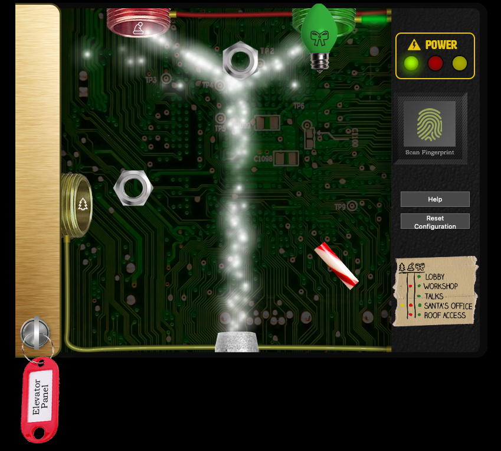

# Operate the Santavator

**Difficulty**: :fontawesome-solid-star::fontawesome-solid-star::fontawesome-regular-star::fontawesome-regular-star::fontawesome-regular-star:<br/>
**Direct link**: [elevator website](https://elevator.kringlecastle.com/?challenge=elevator&id=62341aef-5fd2-4ea6-bdbd-58753ecf2393)<br/>
**Terminal hint**: [Unscape Tmux](../hints/h4a.md) and [The Elf C0de](../hints/h4b.md)


## Objective

!!! question "Objective"
    Talk to Pepper Minstix in the entryway to get some hints about the Santavator.

??? quote "Sparkle Redberry"
    Hey hey, Sparkle Redberry here!
    
    The Santavator is on the fritz. Something with the wiring is grinchy, but maybe you can rig something up?

    Here's the key! Good luck!

    With that key, you can look under the panel and see the Super Santavator Sparkle Stream (S4).

    To get to different floors, you'll need to power the various colored receivers.


## Hints

??? hint "Santavator Operations - Pepper Minstix"
    It's really more art than science. The goal is to put the right colored light into the receivers on the left and top of the panel.

??? hint "Santavator Bypass - Ribb Bonbowford"
    There may be a way to bypass the Santavator S4 game with the browser console...


## Solution

Sparkle Redberry gives you a key to open up the Santavator panel which will reveal the Super Santavator Sparkle Stream (S4) and the yellow, red, and green receivers. There's 2 main ways to solve this challenge,. Either find items and arrange them to color and direct the stream towards the receivers. Alternatively, you can use the [app.js](https://elevator.kringlecastle.com/app.js) JavaScript code to bypass the Santavator. This write-up focuses on the most basic solution to complete the challenge by using 2 items to activate a single floor.

Start by talking to Sparkle Redberry who will hand you a key to open the Santavator panel. You'll find a hex nut in front of the Santavator and a green light bulb in the top left corner of the Courtyard. Open the Santavator panel by clicking on the key and use the hex nut and green light bulb as shown in the image below.



Activating the green receiver will get you to the second floor where the talks are held. You can now find additional items like the red light bulb in the top right corner of the Talks Lobby. Since the hex nut already splits the stream towards the red and green receivers, adding the red light bulb in front of the red receiver will get you access to the Workshop and Roof. Below is an overview of where the different items are located.

| Item                | Floor | Room                                                       |
| :-------------------| :---- | ---------------------------------------------------------- |
| Candycane           | 1     | In front of the castle door on the Front Lawn              |
| Hex nut             | 1     | In front of the Santavator in the Entryway                 |
| Hex nut             | 1     | Behind the table in the Dining Room (hidden from view)     |
| Santavator key      | 1     | Received from Sparkle Redberry                             |
| Green light bulb    | 1     | Top left corner of the Courtyard                           |
| Red light bulb      | 2     | Top right corner of the Talks Lobby                        |
| Yellow light bulb   | R     | Top left corner of the Netwars Room                        |
| Large marble        | 1.5   | In the Workshop                                            |
| Small marble        | R     | Bottom right corner of the Netwars Room (hidden from view) |
| Proxmark            | 1.5   | Wrapping Room                                              |
| Rubber ball         | 1.5   | Wrapping Room                                              |
| Elevator 1.5 button | 2     | Speaker UNPreparedness Room                                |
| Portals             | 2     | Dropped by Release the Snacken!                            |


!!! done "Answer"
    Use the hex nut found in front of the Santavator and the green light bulb found in the Courtyard to power the green receiver.

!!! note "Bypassing the Santavator"
    Another way to solve this challenge and get to the other floors, except for [Santa's office](../objectives/o10.md) which requires *Santa Mode*, is by analysing [app.js](https://elevator.kringlecastle.com/app.js).
    
    The Santavator works by calculating how much colored stream particles are received by each of the receivers. Once the proper amount of each stream color has been collected (line 3), the JavaScript code will change the value of the associated color LED in the `powered` array to `true` (line 7) and turn on the LED by adding the `on` CSS class to the LED HTML element (line 6). Vice versa, when the stream levels drop too low the value in the `powered` array changes back to `false` (line 7) and the LED is turned off by removing the `on` CSS class (line 6). All this is handled by the `renderTraps()` function.

    ```javascript linenums="1" hl_lines="3 6 7"
    const renderTraps = () => {
      TRAPS.forEach((points, index) => {
        const fillLevel = pl.Math.clamp(PARTICLE_COUNTS[index].length / trapTargetCounts[index], 0, 1);
        const steppa = Math.floor(fillLevel / (1 / wireSteps[index]));
        wireElements[index].style.backgroundPosition = `0 ${ -wireElements[index].clientHeight * steppa }px`;
        ledElements[index].classList[fillLevel === 1 ? 'add' : 'remove']('on');
        powered[index] = fillLevel === 1;
      });
  
      btn1.classList[powered[2] ? 'add' : 'remove']('powered');
      btn3.classList[powered[2] ? 'add' : 'remove']('powered');

      btn2.classList[powered[2] && powered[0] && hasToken('workshop-button') ? 'add' : 'remove']('powered');
      btnr.classList[powered[2] && powered[0] ? 'add' : 'remove']('powered');

      btn4.classList[powered[2] && powered[1] && powered[0] ? 'add' : 'remove']('powered');
    };
    ```

    Based on which combination of LEDs are turned on at any given time, the associated buttons will be powered on as well. This is handled by the remainder of the `renderTraps()` function which uses the state of the `powered` array to add a `powered` CSS class to the proper button elements (lines 10-16). Manually adding the `powered` CSS class to each of the panel buttons doesn't work because the `renderTraps()` function is continuously called as the scene is being rendered by the `render()` function and will remove the `powered` class from the buttons whenever the proper conditions aren't met anymore. :unamused:

    ```javascript linenums="1" hl_lines="2-4 13"
    function render(newtime) {
      if (stop) {
        return;
      }
      requestAnimationFrame(render);
      now = newtime;
      elapsed = now - then;
      if (elapsed > fpsInterval) {
        then = now - (elapsed % fpsInterval);

        ... SNIP ...
        
        renderTraps();
      }
    }     
    ```

    Luckily for us, the `render()` function provides a way to skip calling `renderTraps()` altogether. Before doing anything else the function checks the value of a `stop` variable (lines 2-4). If `stop` is `true`, we exit from the function and `renderTraps()` isn't called at all (line 13), thus freezing the stream and preventing any manual changes we make to HTML elements from being reverted. 

    To get to level 1.5 we also need to add the button itself to the panel. The way [app.js](https://elevator.kringlecastle.com/app.js) handles this is by checking if the challenge URL contains a `workshop-button` value as part of the `tokens` GET request parameter. If that's the case a `found` CSS class will be added to the image identified by the `f15btn` CSS class (line 4), which adds the button to the panel.

    ```javascript linenums="1" hl_lines="4"
    const btn15img = document.querySelector('img.f15btn');

    if (hasToken('workshop-button')) {
      btn15img.classList.add('found');
    }
    ```

    We can now bypass the Super Santavator Sparkle Stream by taking the following actions:

    1. Open the web browser's developer tools
    2. Open the panel to expose the circuitry
    3. Enter `stop = true` in the JavaScript console to freeze the stream
    4. Close the panel again 
    5. Add a `found` CSS class to the `f15btn` image
    6. Add a `powered` CSS class to each of the button elements 
