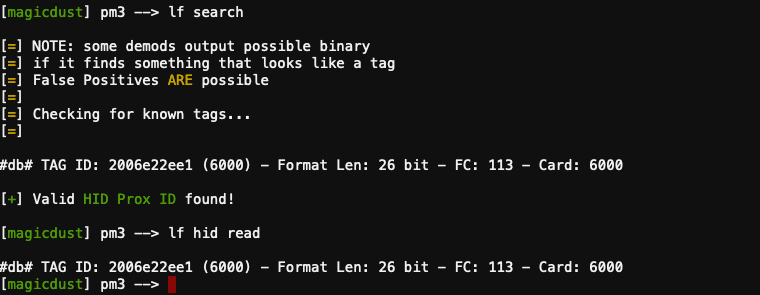
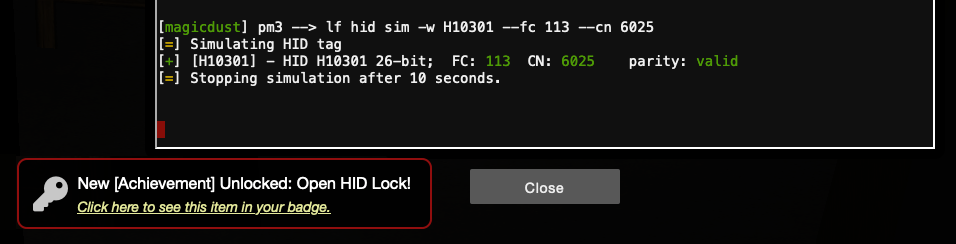

# Open HID Lock

**Difficulty**: :fontawesome-solid-star::fontawesome-solid-star::fontawesome-regular-star::fontawesome-regular-star::fontawesome-regular-star: 
**Direct link**: [proxmark terminal](https://docker2020.kringlecon.com/?challenge=proxmark&id=df38b481-ab8f-4ef4-b281-31ea6483eb95) 
**Terminal hint**: [Speaker UNPrep](../hints/h5a.md) and [33.6kbps](../hints/h5b.md)

## Objective

!!! question "Request"
    Open the HID lock in the Workshop. Talk to Bushy Evergreen near the talk tracks for hints on this challenge. You may also visit Fitzy Shortstack in the kitchen for tips.

??? quote "Bushy Evergreen"
    Some people scan other people's badges and try those codes at locked doors. 
    Other people scan one or two and just try to vary room numbers. 
    Do whatever works best for you!

??? quote "Fitzy Shortstack"
    You know, Santa really seems to trust Shinny Upatree...

## Hints

??? hint "Reading Badges with Proxmark"
    You can use a Proxmark to capture the facility code and ID value of HID ProxCard badge by running `lf hid read` when you are close enough to someone with a badge.

??? hint "Impersonating Badges with Proxmark"
    You can also use a Proxmark to impersonate a badge to unlock a door, if the badge you impersonate has access. ``lf hid sim -r 2006......`

??? hint "What's a Proxmark?"
    The Proxmark is a multi-function RFID device, capable of capturing and replaying RFID events.

??? hint "Short List of Essential Proxmark Commands"
    There's a [short list of essential Proxmark commands](https://gist.github.com/joswr1ght/efdb669d2f3feb018a22650ddc01f5f2) also available.

??? hint "Proxmark Talk"
    Larry Pesce knows a thing or two about [HID attacks](https://www.youtube.com/watch?v=647U85Phxgo). He's the author of a course on wireless hacking!

## Solution

To solve this challenge we need to find a Proxmark device, roam around Santa's castle to scan NPC badges, and use the collected information to open the HID lock in the workshop. The Proxmark device can be found next to the table in the Wrapping Room and after picking it up you'll be able to access the [Proxmark CLI](https://docker2020.kringlecon.com/?challenge=proxmark&id=df38b481-ab8f-4ef4-b281-31ea6483eb95) via the item list on your conference badge.

As per Bushy Evergreen's hint we can either go around scanning all the NPC badges or we can scan just a few and then fill in the blanks. As Larry Pesce mentions in his [HID attacks](https://www.youtube.com/watch?v=647U85Phxgo) HID cards are often sold with sequential ID numbers. So all we really need is just enough information to determine that sequence.

To scan a badge, stand next to an NPC, open the Proxmark CLI and type `lf search` or `lf hid read`. If the NPC has a badge these commands will return the HID card information such as the facility code (FC), and the card ID. 

Walking around the castle we can compile the following list of badge IDs.

| NPC name          | Wiegand    | Facility code  | ID   |
| :-----------------| :--------- | :--------------| :--- |
| Sparkle Redberry  | 2006e22f0d | 113            | 6022 |
| Shinny Upatree    | 2006e22f13 | 113            | 6025 | 
| Holly Evergreen   | 2006e22f10 | 113            | 6024 | 
| Noel Boetie (old) | 2006e22f08 | 113            | 6020 |
| Noel Boetie (new) | 2006e22ee1 | 113            | 6000 |
| Bow Ninecandle    | 2006e22f0e | 113            | 6023 |

!!! note "Noel Boetie's new badge"
    It appears that Noel was issued a replacement badge during the event. When first scanning Noel Boetie's badge his ID number was 6020.

As noted previously, there is no need to scan all of the badges in the above table. If you happen to scan Noel Boetie's old badge and Shinny Upatree's badge it'd be clear that the most likely badge ID sequence is 6020 to 6025.

Now that we have some badge ID values we can head back to the Workshop Room. Stand next to the HID lock, open the Proxmark CLI, and simulate a badge using its Wiegand value. For example, to simulate Sparkle Redberry's badge use `lf hid sim -r 2006e22f0d`. Alternatively, if you're extrapolating badge IDs based on collected information, you can use `lf hid sim -w H10301 --fc 113 --cn 6024` to simulate Holly Evergreen's badge. Simply iterate over all badge IDs until the door unlocks.

If you've already solved the [33.6kbps](../hints/h5b.md) terminal hint then Fitzy Shortstack will have told you that *Santa really seems to trust Shinny Upatree* which confirms our solution. Shinny Upatree's badge is indeed the one that opens the door.

!!! done "Answer"
    Use `lf hid sim -r 2006e22f13` to unlock the door using Shinny Upatree's badge information.

## Being Santa Claus

Walk to the end of the dark hallway. The two lights at the end are [peephole](../easter_eggs.md#painting-peephole-trope) cutouts for the eyes in the portrait hanging behind Santa in the Entryway. If you move forward towards the light you will end up in Santa's body. This is a direct reference to the movie Being John Malkovich and is explained in more detail in the [Easter Egg](../easter_eggs.md#being-john-malkovich) section. It's also where the idea for [this image](../img/misc/being_santa_clause.png) came from. :smile:

!!! Quote "Santa"
    what the hell is this 
    I hear another Santa in my head

You can now roam around as Santa and use the elevator to get to Santa's Office. This also unlocks a whole new set of narratives between Santa and the other NPCs, like the [conference booths](../easter_eggs.md#santa-discounts). Things are starting to make a little more sense now. It appears that Jack Frost has been impersonating Santa and causing all kinds of trouble! :open_mouth:
