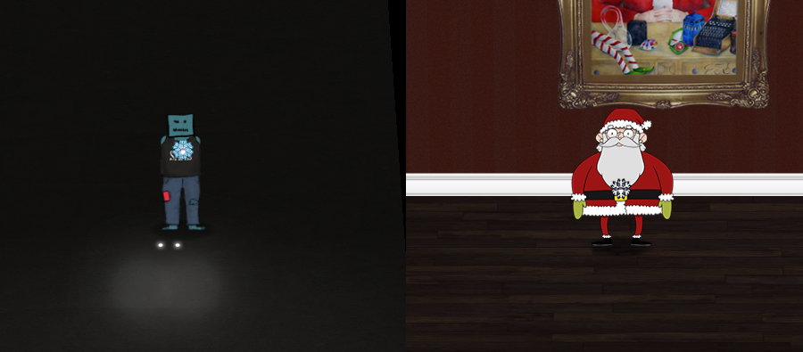

# Open HID Lock

**Difficulty**: :fontawesome-solid-star::fontawesome-solid-star::fontawesome-regular-star::fontawesome-regular-star::fontawesome-regular-star: 
**Direct link**: [proxmark terminal](https://docker2020.kringlecon.com/?challenge=proxmark&id=df38b481-ab8f-4ef4-b281-31ea6483eb95) 
**Terminal hint**: [Speaker UNPrep](../hints/h5a.md) and  [33.6kbps](../hints/h5b.md)

## Objective

!!! question "Objective"
    Open the HID lock in the Workshop. Talk to Bushy Evergreen near the talk tracks for hints on this challenge. You may also visit Fitzy Shortstack in the kitchen for tips.

!!! quote "Bushy Evergreen"
    Some people scan other people's badges and try those codes at locked doors.

    Other people scan one or two and just try to vary room numbers.

    Do whatever works best for you!

!!! quote "Fitzy Shortstack"
    You know, Santa really seems to trust Shinny Upatree...

## Hints

??? hint "Reading Badges with Proxmark - Bushy Evergreen"
    You can use a Proxmark to capture the facility code and ID value of HID ProxCard badge by running `lf hid read` when you are close enough to someone with a badge.

??? hint "Impersonating Badges with Proxmark - Bushy Evergreen"
    You can also use a Proxmark to impersonate a badge to unlock a door, if the badge you impersonate has access. ``lf hid sim -r 2006......`

??? hint "What's a Proxmark? - Bushy Evergreen"
    The Proxmark is a multi-function RFID device, capable of capturing and replaying RFID events.

??? hint "Short List of Essential Proxmark Commands - Bushy Evergreen"
    There's a [short list of essential Proxmark commands](https://gist.github.com/joswr1ght/efdb669d2f3feb018a22650ddc01f5f2) also available.

??? hint "Proxmark Talk - Bushy Evergreen"
    Larry Pesce knows a thing or two about [HID attacks](https://www.youtube.com/watch?v=647U85Phxgo). He's the author of a course on wireless hacking!

## Solution

!!! done "Answer"
    Use `lf hid sim -r 2006e22f13` or `lf hid sim -w H10301 --fc 113 --cn 6025` to impersonate Shinny Upatree's badge

## Being Santa Claus
Walk to the end of the dark hallway and through the glowing lights to enter Santa's body. This is a direct reference to the movie Being John Malkovich and is explained in more detail in the [Easter Egg](../easter_eggs.md#being-john-malkovich) section. It's also where the idea for [this image](../img/misc/being_santa_clause.png) came from. :smile:

!!! Quote "Santa"
    what the hell is this

    I hear another Santa in my head

You can now roam around as Santa and use the elevator to get to Santa's Office. This also unlocks a whole new set of narratives between Santa and the other NPCs, like the [conference booths](../easter_eggs.md#santa-discounts). Things are starting to make a little more sense now. It appears that Jack Frost has been impersonating Santa and causing all kinds of trouble! :open_mouth:
