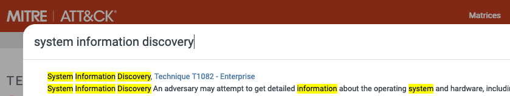
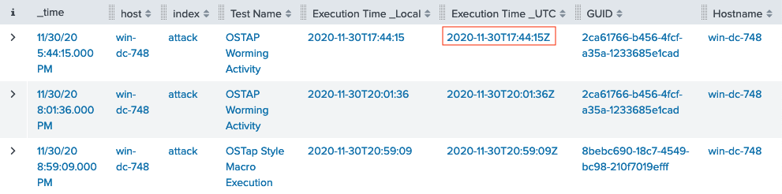
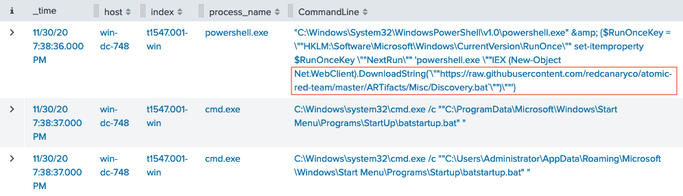

# Splunk Challenge

**Difficulty**: :fontawesome-solid-star::fontawesome-solid-star::fontawesome-solid-star::fontawesome-regular-star::fontawesome-regular-star:<br/>
**Direct link**: [kringleconsoc website](https://splunk.kringlecastle.com/en-US/account/insecurelogin?username=santa&password=2f3a4fccca6406e35bcf33e92dd93135)<br/>
**Terminal hint**: [Sort-o-Matic](../hints/h6.md)


## Objective

!!! question "Request"
    Access the Splunk terminal in the Great Room. What is the name of the adversary group that Santa feared would attack KringleCon?

??? quote "Angel Candysalt"
    Hey Santa, there’s some crazy stuff going on that we can see through our Splunk infrastructure.<br/>
    You better login and see what’s up.


## Hints

??? hint "Adversary Emulation and Splunk"
    Dave Herrald talks about emulating advanced adversaries and [hunting them with Splunk](https://www.youtube.com/watch?v=RxVgEFt08kU).

??? hint "Splunk Basics"
    There was a great [Splunk talk](https://www.youtube.com/watch?v=qbIhHhRKQCw) at KringleCon 2 that's still available!

??? hint "Data Decoding and Investigation"
    Defenders often need to manipulate data to decRypt, deCode, and refourm it into something that is useful. [Cyber Chef](https://gchq.github.io/CyberChef/) is extremely useful here!


## Solution

!!! quote "Alice Bluebird"
    Ok elves! Like Santa said, I simulated a bunch of ATT&CK techniques/sub-techniques and stored the results from each run in its own dedicated set of Splunk indexes. Check out the [Splunk Search Interface](https://splunk.kringlecastle.com/app/SA-kringleconsoc/search) to get started answering Training Question 1. 


### Training question 1

!!! question "Question"
    How many distinct MITRE ATT&CK techniques did Alice emulate?

??? quote "Alice Bluebird"
    I stored every simulation in its own index so you can just use a Splunk search like `| tstats count where index=* by index` for starters!<br/>
    I expect some of the elves in the SOC to confuse techniques with sub-techniques. 

Use the proposed `| tstats count where index=* by index` Splunk query and add query logic to grab the first 5 character from the index field and store it in a `technique` variable, remove any values which don't start with a 't', and finally drop any duplicates. The *Statistics* header will show the total result count.

```splunk linenums="1"
| tstats count where index=* by index 
| eval technique=substr(index,0, 5) 
| search technique=t* 
| dedup technique
```

{: class=border }

!!! done "Answer"
    13


### Training question 2

!!! question "Question"
    What are the names of the two indexes that contain the results of emulating Enterprise ATT&CK technique 1059.003? (Put them in alphabetical order and separate them with a space)

??? quote "Alice Bluebird"
    The search I used was:

    ```splunk
    | tstats count where index=* by index 
    | search index=T*-win OR T*-main
    | rex field=index "(?<technique>t\d+)[\.\-].0*" 
    | stats dc(technique)
    ```

    Training question 2 is almost too easy, especially if they use that search I just shared.<br/>
    I just really want those elves to understand what a Splunk index is, though. I'd expect them to Google it, but had to point a few of them to this [definition](https://docs.splunk.com/Splexicon:Index).

Similar to the previous question. Search for all index names beginning with `t1059.003` and sort the results alphabetically.

```splunk linenums="1"
| tstats count where index=* by index
| search index=t1059.003*
| sort index
```

{: class=border }

!!! done "Answer"
    t1059.003-main t1059.003-win


### Training question 3

!!! question "Question"
    One technique that Santa had us simulate deals with 'system information discovery'. What is the full name of the registry key that is queried to determine the MachineGuid?

??? quote "Alice Bluebird"
    Now we can talk about some interesting stuff. What's actually in those emulation indexes!<br/>
    I'm assuming they watched the Splunk KringleCon talk and picked up on how to search MITRE's site, and that they should check out the atomics for that technique in the Atomic Red Team github repo.<br/>
    I want them to be comfortable searching in places like [Atomic Red Team](https://github.com/redcanaryco/atomic-red-team)

Answering this question doesn't require a Splunk query and is all about searching [MITRE ATT&CK Techniques](https://attack.mitre.org/techniques/) and [Atomic Red Team Atomics](https://github.com/redcanaryco/atomic-red-team) resources. A seach for *system information discovery* on the MITRE ATT&CK website yields technique ID T1082.

{: class=border }

The [atomics page](https://github.com/redcanaryco/atomic-red-team/blob/master/atomics/T1082/T1082.md#atomic-test-8---windows-machineguid-discovery) for MITRE ATT&CK technique T1082 lists the registry key near the bottom of the page.

{: class=border }

!!! done "Answer"
    HKEY_LOCAL_MACHINE\SOFTWARE\Microsoft\Cryptography


### Training question 4

!!! question "Question"
    According to events recorded by the Splunk Attack Range, when was the first OSTAP related atomic test executed? (Please provide the alphanumeric UTC timestamp.)

??? quote "Alice Bluebird"
    Those folks over at Red Canary sure do like using OSTAP in their atomics, don't they?<br/>
    I suppose the SOC elves might overthink this one. Splunk Attack Range keeps track of the simulations that are run in `index=attack`<br/>
    You can then search that index for specific keywords... 

All we need to do is search for *OSTAP* across the whole *attack* index and sort the results by timestamp.

```splunk linenums="1"
index=attack
| search "OSTAP"
| sort "Execution Time _UTC"
```

{: class=border }

!!! done "Answer"
    2020-11-30T17:44:15Z


### Training question 5

!!! question "Question"
    One Atomic Red Team test executed by the Attack Range makes use of an open source package authored by frgnca on GitHub. According to Sysmon (Event Code 1) events in Splunk, what was the ProcessId associated with the first use of this component?

??? quote "Alice Bluebird"
    Oh this was a fun one. It takes a bit of pivoting... 

Start by [searching](https://github.com/search?q=frgnca&type=users) GitHub for *frgnca* which leads to the [frgnca/AudioDeviceCmdlets](https://github.com/frgnca/AudioDeviceCmdlets) repository. Next, [search](https://github.com/redcanaryco/atomic-red-team/search?q=AudioDeviceCmdlets) for *AudioDeviceCmdlets* in the Atomic Red Team repository which leads to [T1123.md](https://github.com/redcanaryco/atomic-red-team/blob/910a2a764a66b0905065d8bdedb04b37049a85db/atomics/T1123/T1123.md). Finally, search all Splunk indexes beginning with *T1123* for process creation events (i.e., [Sysmon Event ID 1](https://www.ultimatewindowssecurity.com/securitylog/encyclopedia/event.aspx?source=Sysmon&eventID=1)) containing the string *WindowsAudioDevice-Powershell-Cmdlet*. The parent PowerShell process with PID 3648 matches the first use of the component.

```splunk linenums="1"
index=T1123*
| search EventCode=1
| search *WindowsAudioDevice-Powershell-Cmdlet*
```

{: class=border }

!!! done "Answer"
    3648


### Training question 6

!!! question "Question"
    Alice ran a simulation of an attacker abusing Windows registry run keys. This technique leveraged a multi-line batch file that was also used by a few other techniques. What is the final command of this multi-line batch file used as part of this simulation?

[T1547.001](https://github.com/redcanaryco/atomic-red-team/blob/9c90036704c70fa2b043fb04402514bcfe9c7cc4/atomics/T1547.001/T1547.001.md) contains information related to *Registry Run Keys / Startup Folder*. Search all indexes beginning with *T1547.001* for process command lines matching *\*.bat\**. One entry contains a PowerShell download of `https://raw.githubusercontent.com/redcanaryco/atomic-red-team/master/ARTifacts/Misc/Discovery.bat`.

```splunk linenums="1"
index=T1547.001*
| search CommandLine=*.bat*
| sort _time
```

{: class=border }

Download [Discovery.bat](https://raw.githubusercontent.com/redcanaryco/atomic-red-team/master/ARTifacts/Misc/Discovery.bat) to find the final command.

{: class=border }

!!! done "Answer"
    quser


### Training question 7

!!! question "Question"
    According to x509 certificate events captured by Zeek (formerly Bro), what is the serial number of the TLS certificate assigned to the Windows domain controller in the attack range?

??? quote "Alice Bluebird"
    I did not know if I should leave this one in here because it uses the old name for Zeek! In the meantime, I wanted them to look at something like `index=* sourcetype=bro*` and check out the SSL/TLS certs that are captured in the x509-related sourcetype. 

Execute the search query provided by Alice and use the fields to the left of the search results to filter on `certificate.subject`, which is the most likely certificate field to contain a full hostname. Select the entry matching the Windows Domain Controller (i.e. *win-dc*) in the attack range (i.e., *attackrange.local*).

```splunk linenums="1"
index=* sourcetype=bro*
"certificate.subject"="CN=win-dc-748.attackrange.local"
```

{: class=border }

Expand any of the search results to find the `certificate.serial` field.

{: class=border }

!!! done "Answer"
    55FCEEBB21270D9249E86F4B9DC7AA60


### Challenge question

!!! question "Question"
    What is the name of the adversary group that Santa feared would attack KringleCon?

!!! quote "Alice Bluebird"
    This last one is encrypted using your favorite phrase! The base64 encoded ciphertext is: `7FXjP1lyfKbyDK/MChyf36h7`<br/>
    It's encrypted with an old algorithm that uses a key. We don't care about RFC 7465 up here! I leave it to the elves to determine which one!

Dave Herrald's [Adversary Emulation and Automation](https://www.youtube.com/watch?v=RxVgEFt08kU) talk hints at Santa's favorite phrase supposedly being *Stay Frosty*. Although, we now know that's most likely because Jack Frost has been walking around pretending to be Santa. 


[RFC 7465](https://tools.ietf.org/html/rfc7465) or *Prohibiting RC4 Cipher Suites* tells us which cipher was used to encrypt the information. Use [Cyber Chef]((https://gchq.github.io/CyberChef/)) to decode the BASE64-encoded string (1) and run the output (2) through an RC4 recipe with *Stay Frosty* as the passphrase (3).

{: class=border }

!!! done "Answer"
    [The Lollipop Guild](../easter_eggs.md#the-lollipop-guild)
