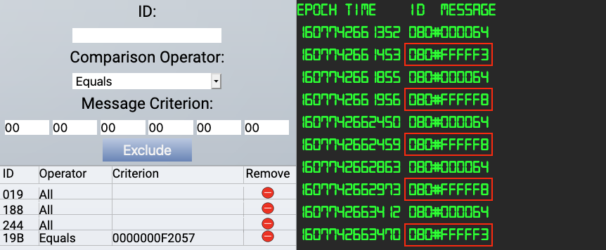

# Solve the Sleigh's CAN-D-BUS Problem

**Difficulty**: :fontawesome-solid-star::fontawesome-solid-star::fontawesome-solid-star::fontawesome-regular-star::fontawesome-regular-star: 
**Direct link**: [candbus website](https://candbus.kringlecastle.com/?challenge=candbus&id=d02344b9-d758-4e3f-a189-4dbdc154a277) 
**Terminal hint**: [CAN-Bus Investigation](../hints/h7.md)

## Objective

!!! question "Request"
    Jack Frost is somehow inserting malicious messages onto the sleigh's CAN-D bus. We need you to exclude the malicious messages and no others to fix the sleigh. Visit the NetWars room on the roof and talk to Wunorse Openslae for hints.

??? quote "Wunorse Openslae"
    Say, do you have any thoughts on what might fix Santa's sleigh? 
    Turns out: Santa's sleigh uses a variation of CAN bus that we call CAN-D bus. 
    And there's something naughty going on in that CAN-D bus. 
    The brakes seem to shudder when I put some pressure on them, and the doors are acting oddly. 
    I'm pretty sure we need to filter out naughty CAN-D-ID codes. 
    There might even be some valid IDs with invalid data bytes.

## Hints

??? hint "CAN ID Codes"
    Try filtering out one CAN-ID at a time and create a table of what each might pertain to. What's up with the brakes and doors?

## Solution

Solving this challenge requires a bit of trial and error. A good approach is to start with blocking everything, unblock one ID at a time, and see how each of the sleigh's controls influences the CAN-D bus ID codes and message values. Wunorse Openslae told us that *The brakes seem to shudder when I put some pressure on them, and the doors are acting oddly.*, so we probably want to focus on those parts in particular. By gradually testing each component you can build a table with CAN-D bus ID codes and message values.

| Sleigh control  |  CAN-D bus ID | Message value            |
| :-------------- | :------------ | :------------------------|
| Start           | 02A           | 00FF00                   |
| Stop            | 02A           | 0000FF                   |
| Lock            | 19B           | 000000000000             |
| Unlock          | 19B           | 00000F000000             |
| Steering        | 019           | FFFFFFCD to 00000032     |
| Brake           | 080           | 000000 to 000064         |
| Accelerator     | 244           | 0000000000 to 0000002379 |
| Unknwown        | 188           | 00000000                 |

The *Lock* and *Unlock* buttons should generate 2 message values for ID `19B`. However, when you filter out everything except for ID `19B` you'll notice that out of nowhere additional `0000000F2057` message values appear on the CAN-D bus. We can't have anything happen with the sleigh doors at high altitudes so those need to be filtered out using `19B Equals 0000000F2057`.

The second issue is that, when we pump the brakes, spurious negative message values appear on the CAN-D bus for ID `080`. Either you keep your foot off the brakes and the message value is `000000` or you press the brakes and the value gradually goes up to `000064`. Negative values don't make sense, so we filter those out by adding `080 Less 000000000000`.

Once both exclusions are in place a *Sleigh deFrosted!* message appears, indicating success.

!!! done "Answer"
    `080 Less 000000000000`

    `19B Equals 0000000F2057`

